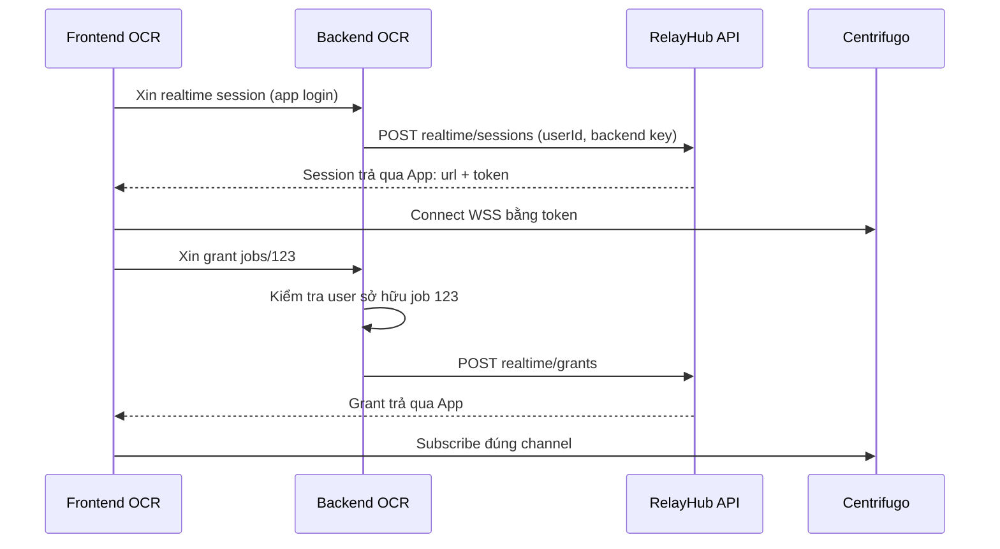

# Integration flows — một domain cho mọi app

Base URL duy nhất `https://relayhub.dungxbuif.com`. Pseudocode mô tả SDK dự kiến, không phải code có thể chạy ngay.

## 1. Đăng ký app một lần

Admin qua Tailnet tạo project `ocr-prod`, queue `extract-text`, policy `jobs/{jobId}`, allowed origin của frontend OCR. Tạo backend key và worker key riêng. Lưu key trong secrets của từng deployment; không đưa vào frontend hoặc commit vào repo.

Queue tạo trước, channel cụ thể được dùng động dưới policy. Hai project có thể dùng cùng logical queue/channel name và vẫn cách ly.

## 2. Frontend đăng nhập và subscribe



```ts
// Backend app: quyền nghiệp vụ do app sở hữu.
async function grantJob(req) {
  const user = requireLogin(req);
  const job = await appDB.jobs.get(req.params.jobId);
  if (!job || job.userId !== user.id) throw Forbidden();
  return relay.realtime.createSubscriptionGrant({
    userId: user.id, channel: `jobs/${job.id}`,
  });
}

// Frontend: chỉ xin token từ backend của app.
const realtime = new RelayRealtime({
  baseUrl: "https://relayhub.dungxbuif.com",
  getSession: () => appApi.post("/realtime/session"),
});
await realtime.connect();
realtime.subscribe(`jobs/${jobId}`, {
  getGrant: () => appApi.post(`/jobs/${jobId}/realtime-grant`),
  onMessage: event => applyIfNewer(event),
  onRecoveryFailed: () => refreshJobSnapshot(jobId),
});
```

Một socket có nhiều subscriptions. Để tránh race snapshot/subscription: subscribe và buffer trước, lấy snapshot có stateVersion, rồi áp dụng events mới hơn snapshot; khi gap thì fetch lại. App cần version dữ liệu nếu yêu cầu nhất quán này. Không xem history realtime là lưu trữ kết quả.

## 3. Enqueue và xử lý

```ts
// App outbox publisher: cùng key khi retry.
const relay = new RelayServer({
  baseUrl: "https://relayhub.dungxbuif.com",
  apiKey: env.RELAY_BACKEND_KEY,
});
await relay.jobs.enqueue("extract-text", {
  appJobId: job.id, fileId: file.id,
}, {
  idempotencyKey: `extract:${job.id}:v1`,
  handlerVersion: "v1",
  progressChannel: `jobs/${job.id}`,
});

const worker = new RelayWorker({
  baseUrl: "https://relayhub.dungxbuif.com",
  apiKey: env.RELAY_WORKER_KEY,
  concurrency: 2,
});
worker.handle("extract-text", { version: "v1" }, async (job, ctx) => {
  const cached = await results.find(job.data.appJobId);
  if (cached) return cached;
  const result = await extract(job.data.fileId, {
    signal: ctx.signal,
    onProgress: percent => ctx.progress({ percent }),
  });
  // Handler cần transaction/unique key hay downstream idempotency phù hợp.
  return await results.saveIdempotently(job.data.appJobId, result);
});
await worker.start();
```

SDK giữ lease heartbeat; ctx.progress chỉ đi đến channel đã gắn, không chọn channel tùy ý. Handler trả về thì SDK complete. Handler throw thì SDK fail. Khi mất lease, SDK abort signal, bỏ complete của attempt cũ và báo trạng thái; effect ngoài hệ thống vẫn phải chống trùng.

## 4. Khi có lỗi

| Tình huống | Hành vi |
|---|---|
| Browser đóng tab | Job tiếp tục; mở lại lấy snapshot và subscribe |
| Nhà mất mạng | VPS giữ accepted/queued; worker reconnect sau |
| NATS tạm offline | Job đã commit nằm ở outbox, trạng thái accepted |
| PostgreSQL không ghi được | Enqueue lỗi; client retry cùng key |
| Worker chết | Lease hết hạn → retry theo policy |
| Complete response thất lạc | SDK retry complete; server trả cùng kết quả |
| Hết attempts | Failed view; operator replay thành job mới |
| Centrifugo restart | Reconnect, recovery có thể thất bại → snapshot |

## 5. Domain boundary

Frontend của app có thể ở domain khác. Chỉ origins đã đăng ký được phép gọi browser-facing endpoints/WSS; backend và worker không bị giả định là browser. Admin dashboard dùng cùng domain nhưng chỉ qua Tailnet và login. CORS không kiểm soát quyền project; auth và scope được kiểm tra riêng.
