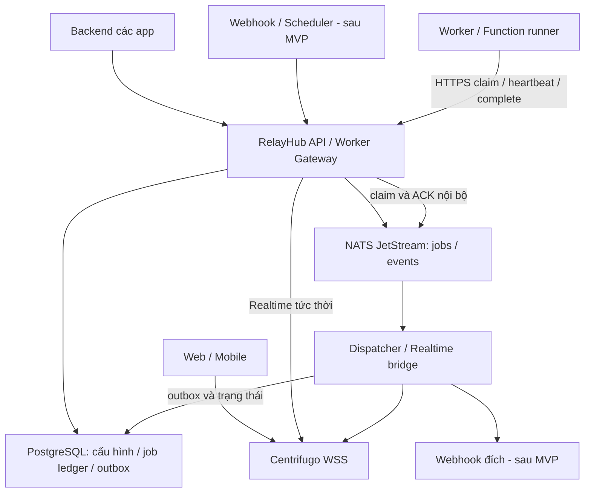

# RelayHub — system design v0.1

Ngày: 2026-09-10 · Trạng thái: Planning baseline

## 1. Nguyên tắc kiến trúc

RelayHub là third-party provider. Giao diện bên ngoài là HTTPS/WSS + API/SDK có version. NATS, PostgreSQL và API quản trị Centrifugo là nội bộ, không public. Tailnet phục vụ quản trị và kết nối riêng, không là điều kiện để app tích hợp.

Tách control plane (project, credentials, quyền, cấu hình) khỏi luồng dữ liệu về trách nhiệm, nhưng dùng một codebase Go ở bản đầu. Có thể chạy API và dispatcher thành process riêng, chưa chia thành nhiều microservice.

## 2. Stack baseline

| Thành phần | Công nghệ | Ghi chú |
|---|---|---|
| API, worker gateway, dispatcher | Go | HTTP API; SDK worker không cần biết broker |
| Realtime | Centrifugo OSS | Một node memory engine cho MVP; history mất khi restart |
| Jobs/events bền | NATS JetStream, file storage | Consumer ACK; retention/limits cấu hình tường minh |
| Metadata và job ledger | PostgreSQL | Database/user riêng, job ledger và outbox |
| Function handler | Worker/container | Code tin cậy, pin phiên bản; chưa chạy code tùy ý |
| Dashboard | React + TypeScript + Vite | Admin UI; không cần SSR |
| SDK | TypeScript, Python sau | Tách frontend/backend/worker capabilities |
| Triển khai | Docker Compose | Ghim version/digest; xác minh ARM64 trước triển khai |
| Ingress | Nginx/Caddy hiện có | HTTPS/WSS, route riêng cho provider |

Không thêm Redis trong MVP. Nếu cần nhiều node realtime hoặc history ngoài process, đánh giá engine được Centrifugo hỗ trợ tại phiên bản ghim. JetStream không tự biến thành realtime history engine; bridge là thành phần tường minh.

## 3. Sơ đồ

## 4. Ba ngữ nghĩa giao nhận

### Realtime tức thời

API kiểm tra quyền/quota và gọi Centrifugo publish. Dùng cho tiến độ/typing/chunks AI. Publish thành công nghĩa là gateway chấp nhận, không chứng minh user đã đọc. Có sequence hoặc state version khi app cần phát hiện thiếu dữ liệu. Không đưa từng token AI vào durable stream theo mặc định.

### Jobs bền

Worker gateway lấy dispatch record từ durable consumer. PostgreSQL giữ ledger job và attempt để kiểm tra trạng thái/lease qua mọi API instance. Lease token ngẫu nhiên lưu hash, ràng buộc project, worker, attempt và deadline; claim/complete dùng transaction và compare-and-set. Message NATS là thông báo giao việc, không phải bằng chứng worker có quyền hoàn tất.

Heartbeat gia hạn lease PostgreSQL; gateway gia hạn ACK deadline khi còn giữ delivery. Nếu API restart hoặc broker giao lại trong khi lease còn hiệu lực, record được trì hoãn, không khởi chạy song song. Lease hết hạn được reconciler thu hồi; lần claim sau tạo attempt mới. Worker cũ bị từ chối với `LEASE_LOST`, nhưng tác dụng phụ bên ngoài vẫn cần idempotency.

Retry được lưu dưới dạng `next_attempt_at`; scheduler phát dispatch record mới qua outbox khi đến hạn. Hết attempts hoặc tuổi job thì ledger ghi failed. Dashboard failed jobs là dead-letter view trong MVP, chưa cần một broker DLQ riêng.

### Event fan-out

Stream sự kiện có retention theo thời gian/dung lượng; mỗi subscription có durable consumer riêng. Không dùng cùng semantics xóa-sau-một-ACK của work queue cho mọi subscriber. Realtime bridge ACK sau khi Centrifugo nhận publish; crash tại ranh giới này có thể phát trùng. Frontend dedup bằng event ID khi cần.

## 5. Lưu bền và tính nhất quán

- PostgreSQL lưu payload job, ledger, attempts, idempotency và outbox trong một transaction. JetStream lưu dispatch records và event streams; mỗi phần có trách nhiệm rõ ràng.
- Enqueue trả `202` sau PostgreSQL commit bền (fsync/synchronous_commit bật), trạng thái `accepted`. NATS gián đoạn không làm mất job đã nhận; outbox tiếp tục publish khi phục hồi, trong giới hạn quota.
- Dispatcher publish với message ID ổn định, chờ PubAck rồi đánh dấu outbox sent. Crash giữa PubAck và DB update có thể phát trùng; job ledger/dedup vẫn bảo vệ việc claim.
- Complete ghi result reference, attempt terminal và completion outbox trong một transaction trước broker ACK. Complete gửi lại cùng attempt/kết quả trả thành công; kết quả khác trả conflict.
- Reconciler phát hiện accepted chưa dispatch, retry đến hạn và lease hết hạn. Job chưa terminal không bị xóa chỉ vì retention broker hết; có thể phát lại dispatch record từ ledger.
- Event fan-out sau MVP có consumer riêng; không dùng work-queue retention cho nhiều subscriber.
- Không cam kết ordering toàn cục. Transaction này không bao phủ database hoặc tác dụng phụ của app.

## 6. Dữ liệu và hợp đồng

Entities PostgreSQL: `projects`, `api_keys`, `queues`, `channel_policies`, `worker_registrations`, `jobs`, `attempts`, `idempotency_records`. Sau MVP thêm `functions`, `function_versions`, `routes`, `webhook_endpoints`, `schedules`.

Envelope bền: `id`, `project_id`, `type`, `schema_version`, `occurred_at`, `correlation_id`, `payload` hoặc `payload_ref`. Event ID giữ ổn định khi retry; attempt ID thay đổi theo lần chạy. Secret không nằm trong payload/log.

API nháp:

| Endpoint | Vai trò |
|---|---|
| `POST /api/v1/realtime/publish` | Backend phát realtime |
| `POST /api/v1/realtime/sessions` | Backend yêu cầu connection token |
| `POST /api/v1/realtime/grants` | Backend yêu cầu subscription grant |
| `POST /api/v1/jobs` | Enqueue, hỗ trợ idempotency key |
| `GET /api/v1/jobs/{id}` | Trạng thái trong project |
| `POST /api/v1/jobs/{id}/replay` | Tạo lần chạy mới có audit |
| `POST /api/v1/workers/claim` | Long-poll lấy job có lease |
| `POST /api/v1/attempts/{id}/heartbeat` | Gia hạn lease |
| `POST /api/v1/attempts/{id}/complete` | Ghi kết quả và xác nhận |
| `POST /api/v1/attempts/{id}/fail` | Báo lỗi để xét retry |

Hợp đồng chi tiết ở [API_CONTRACT.md](API_CONTRACT.md). Cancellation và public event fan-out API nằm ngoài MVP.

## 7. Auth và cách ly

App backend xác thực user và kiểm tra quyền nghiệp vụ. Bằng credentials có scope, backend yêu cầu RelayHub cấp token ngắn hạn cho đúng channel. Browser không tự quyết định quyền bằng tên channel. RelayHub/Centrifugo xác minh token; mọi resource lookup đều gắn project từ credentials.

Credentials backend và worker tách scope; chỉ lưu hash API key, có rotation/revocation. Khóa ký token là secret riêng. Chặn truy cập public vào broker, DB và Centrifugo admin API. Mỗi project có rate/backlog/payload/concurrency limits. Namespace không thay thế kiểm tra quyền.

Webhook outbound tương lai dùng allowlist/policy đích, kiểm soát redirect và SSRF; truy cập private network chỉ khi được cấu hình rõ ràng. Functions tùy ý cần sandbox riêng, không mount Docker socket vào runtime người dùng.

## 8. Placement trên homelab

Topology dự kiến gồm VPS public, worker Mac mini và các node homelab. Chưa audit live capacity. Tài liệu hạ tầng riêng không được đưa vào repository này.

| Node | Vai trò đề xuất |
|---|---|
| VPS | API, dispatcher, Centrifugo, JetStream và PostgreSQL riêng cho RelayHub |
| Mac mini | OCR/LLM worker, runtime cần phần cứng cục bộ |
| Pi5 | Worker nhẹ hoặc backup bổ sung |
| Orange Pi | Giữ edge cho app trong nhà |

Public ingress RelayHub kết thúc tại VPS, không phụ thuộc tunnel về nhà. Cần thêm TLS/host route đúng cấu hình Nginx hiện có khi triển khai; không mặc định tái sử dụng TLS đang kết thúc ở Orange Pi. Worker có thể dùng Tailnet, nhưng worker khách ngoài dùng HTTPS outbound.

Khi nhà offline, VPS vẫn nhận job. Nếu job cần file chỉ lưu trên RustFS ở nhà thì phải chờ nhà online; để nhận upload lúc đó cần object storage truy cập độc lập với nhà. Queue không chứa file lớn.

Một VPS là single point of failure. File storage không đồng nghĩa chịu được mất ổ đĩa. Cần cấu hình durability, backup JetStream/PostgreSQL, retention và thử restore; RPO/RTO chưa cam kết. Chưa xác nhận VPS đủ tài nguyên để chạy toàn bộ stack.

## 9. Vận hành và kiểm chứng

Metrics: outbox backlog, publish errors/latency, active connections, queue depth, tuổi job lâu nhất, retry/failure count, worker heartbeat, dung lượng lưu trữ. Dùng monitoring hiện có nếu phù hợp. Log có request/event/job ID, tránh body và secret mặc định.

Kiểm thử lỗi tại các ranh giới: sau PubAck trước HTTP response; sau tác dụng phụ trước ACK; API restart khi worker giữ lease; Centrifugo restart; mất mạng nhà; DB ledger không khả dụng; đầy quota; cross-project access. Xác minh ARM64, pin version và license từng dependency trước deployment.

## 10. Nguồn tham khảo đã dùng trong thảo luận

- [Centrifugo engines](https://centrifugal.dev/docs/server/engines)
- [Centrifugo JWT authentication](https://centrifugal.dev/docs/server/authentication)
- [NATS JetStream consumers](https://docs.nats.io/learn/jetstream/pull-consumers)
- [Supabase Queues + Functions](https://supabase.com/docs/guides/queues/consuming-messages-with-edge-functions)
- [Ably Queues](https://ably.com/docs/platform/integrations/queues)
- [Webhook Relay Security & Tech](https://webhookrelay.com/docs/security/)

Các nguồn là căn cứ lựa chọn, không thay việc kiểm tra theo release khi triển khai. Stack trên là đề xuất cho RelayHub, không phải stack được xác nhận của Webhook Relay.

## 11. Domain và routing đã chốt

| Path | Upstream | Quyền |
|---|---|---|
| `/api/v1/*` | Go API | Project/worker bearer credentials hoặc admin session |
| `/api/v1/admin/*` | Go admin API | Tailnet + admin session, kiểm tra trước rule API chung |
| `/connection/websocket` | Centrifugo | Connection token; grant riêng cho subscription |
| `/hooks/*` | Webhook ingress phase 2 | Chưa mở trong MVP; trả 404 |
| `/healthz` | Go liveness | Chỉ trả trạng thái tối thiểu |
| `/*` | Dashboard | Tailnet + đăng nhập admin |

Proxy ưu tiên route cụ thể trước SPA fallback; không chuyển lỗi API thành HTML. Giữ Upgrade cho WSS; long-poll timeout lớn hơn claim wait. API nội bộ Centrifugo và readiness chi tiết không có public route.

DNS public trỏ VPS; split DNS qua Tailnet cho cùng hostname phục vụ quản trị. VPS TLS không phụ thuộc Caddy tại Orange Pi. Allowed origins khai báo chính xác theo project, không wildcard cùng credentials; Origin không thay auth. Path và scope cách ly dịch vụ trên cùng domain.

## 12. Lý do lựa chọn realtime/MQ

Centrifugo là server tái sử dụng, Gorilla/Coder là thư viện transport; nhúng Centrifuge đòi tích hợp thêm lifecycle/auth/operations. Chọn Centrifugo để giảm code realtime phải sở hữu, chưa có benchmark khẳng định nhanh nhất. SDK chấp nhận phụ thuộc giao thức Centrifugo bên dưới.

JetStream được chọn làm engine messaging; Kafka chưa được chọn do MVP ưu tiên job/realtime và chi phí vận hành thấp. API dùng khái niệm job/channel, không public subject/partition/offset. Không xây universal broker adapter trong MVP.

## 13. Public documentation routing

Reserve `/docs/` and all its static/agent/download assets as public routes before protected dashboard fallback. Use the same relayhub.dungxbuif.com domain. Internal planning is not part of the publish source; see [DOCUMENTATION_STRATEGY.md](DOCUMENTATION_STRATEGY.md). This route is planned and not implemented in the bootstrap router.
