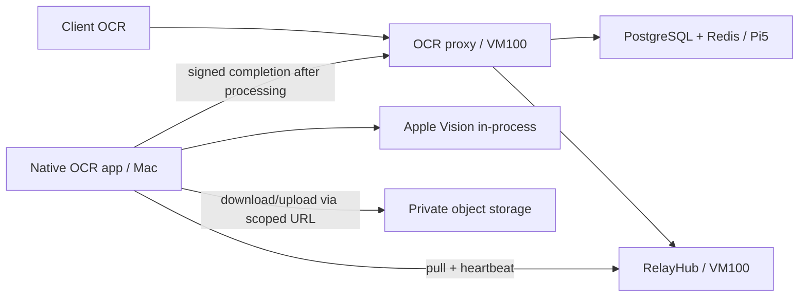

# Ke hoach tich hop OCR qua RelayHub

Trang thai: SUPERSEDED cho phan topology native. Quy tac moi: chi tich hop consumer trong OCR proxy, giu nguyen native app va HTTP/callback/tunnel hien tai. Khong build hay restart native. Tai lieu hien hanh: mac-ocr/docs/RELAYHUB_INTEGRATION.md. Phan duoi luu lai de truy vet phuong an truoc, khong dung lam lenh trien khai.

Quyet dinh 2026-09-20: tich hop truc tiep vao OCR proxy va native app hien co. Khong tao adapter, worker process hay container moi. Chi xoa du lieu test; giu admin va du lieu OCR that. Kiem tra DB RelayHub: applications/events/deliveries/queue_subscriptions/queue_deliveries/functions/function_invocations/outbox deu rong; admin_users co 1 ban ghi, khong can lenh xoa.

## Hien trang da doi chieu

- Source OCR: `/Users/dungxbuif/workspace/mac-ocr`.
- VM100 dang chay image `homelab/macocr-proxy:vm100-20260910`. Can doi chieu source/build truoc migration vi source hien tai co the moi hon image.
- Source proxy goi native bang `DispatchOCR` / `DispatchScan`, nhan HTTP accepted voi `attemptId`, roi nhan callback bat dong bo.
- Native engine dung Apple Vision tren macOS, cong local 8787; callback co eventId, documentId, attemptId, ket qua va capacity.
- Tai lieu tunnel hien tai mo ta proxy -> Rathole VPS:18087 -> Mac:8787. Day la thong tin tai lieu, can xac minh live truoc cutover; khong coi doc cu la trang thai da xac nhan.
- Chua tim thay adapter RelayHub trong source OCR da kiem tra. LLM tiep tuc dung duong hien tai.

## Muc tieu

Mac xu ly OCR du o LAN hay ben ngoai bang ket noi outbound HTTPS toi RelayHub. Proxy public, auth, quotas, document IDs, polling, SSE/MCP va webhook cho nguoi dung giu nguyen hop dong. PostgreSQL/Redis van o Pi5. Native engine khong can public endpoint.

## Luong de xuat

Queue cho OCR; khong dung remote function vi deadline 1-30 giay khong phu hop voi tai lieu dai, Mac sleep hay mat mang. Realtime chi la progress; khong dung lam nguon ket qua chinh.

## Thanh phan

1. Hai app RelayHub: `ocr-proxy` va `ocr-worker-mac`; moi app co credential rieng. Subscription `ocr-jobs` thuoc worker, loc `ocr.document.requested` va `ocr.scan.requested`.
2. Proxy dispatcher ghi outbox cung transaction tao/claim cong viec; publisher retry voi idempotency key tu documentId + attemptId. Mot attempt chi chon mot transport, khong gui ca native truc tiep va RelayHub.
3. Native app tich hop HTTP client va queue consumer, goi Apple Vision trong cung process. Moi replica dung cung subscription `ocr-jobs`, khong tao subscription rieng tung may.
4. Giu callback signed native -> proxy hien co. Proxy fence theo attemptId va commit ket qua/notification truoc khi tra HTTP success. Khong can completion subscription moi.
5. Chi ACK queue sau khi proxy chap nhan ket qua ben vung. Lease renewal khong dong nghia exactly-once: crash/lease expiry van co the xu ly lap; ket qua muon khong duoc ghi de attempt moi.

## Hop dong du lieu

- Job event: documentId, attemptId, objectId, options da validate, deadline. Khong gui file/base64 hoac credential trong event.
- Lay URL tai file ngan han ngay truoc xu ly qua endpoint worker-auth cua proxy. Ho tro cap lai URL khi job cho lau; khong luu URL het han lam dau vao duy nhat cua job.
- Ket qua nho co the dung event; ket qua lon duoc upload object va gui result reference/checksum. RelayHub HTTP body gioi han 1 MiB, vi vay can co nguong va test payload boundary ro rang.
- Proxy xac minh checksum, ownership, attemptId va generation truoc khi ghi trang thai terminal. Duplicate completion phai la no-op; late completion khong duoc ghi de attempt moi.
- Giay phep truy cap file va callbacks chi cap cho service can thiet. Khong noi Mac vao DB hoac mo public database.

## Capacity, retry va recovery

- Consumer doc capacity truc tiep tu native actor, ban dau concurrency 1, chi tang sau benchmark anh/PDF. Dung available units thay vi chi dem so job.
- Lease ban dau 120 giay, heartbeat 30 giay; chon total lease cap theo tai lieu dai nhat da benchmark. Retry tam thoi co backoff; invalid input vao dead letter.
- Native bat dau xu ly chua phai OCR hoan thanh: consumer giu lease toi khi callback duoc commit.
- Persist ket qua chua gui trong application-support directory; restart app thi retry outbox truoc khi nhan them viec. Sau lease expiry, ket qua cu phai qua attempt fence; khong ACK receipt cu.
- Theo doi documentId/attemptId o OCR va event_id/delivery_id/subscription_id o RelayHub. Luu mapping co gioi han, khong log noi dung tai lieu, signed URL, token hay OCR text.

## Thu tu trien khai

1. Inventory live proxy, native, DB/schema va network; snapshot DB/config va ghi image rollback. Xac minh storage, retention va hop dong OCR dang public.
2. Tao contract tests va native/proxy integration sau feature flag `direct` / `relayhub`. Dung app/subscription test rieng; chua thay dispatcher hien tai.
3. Canary voi anh/PDF synthetic: submit -> lease -> native -> completion -> DB/result -> notification. Kiem tra duplicate, worker busy, retry va dead letter.
4. Test Mac ngoai LAN, sleep/wake, restart Docker/native, mat ket noi, callback loi, signed URL het han, lease expiry va payload lon. Khong test bang tai lieu nguoi dung.
5. Cutover tung nhom request moi; drain job direct dang chay truoc khi tat duong cu. Theo doi backlog, oldest job, error rate, latency va tai nguyen.
6. Khi acceptance pass, cap nhat docs/deploy source, dong rieng listener OCR Rathole. Khong dong tunnel LLM. Giu rollback image/config co thoi han.

## Acceptance va rollback

- Mot document chi co mot ket qua terminal hop le du co duplicate delivery/restart.
- Client API, auth, polling, SSE/MCP va webhook khong bi thay doi ngoai hop dong da duyet.
- Mac ngoai LAN xu ly duoc bang outbound HTTPS; khong can DB access hay inbound public port.
- Queue nhan lai job sau crash, outbox ket qua replay duoc, deadline va DLQ co log truy vet.
- Rollback: ngung tao RelayHub job moi, drain/fence job da gui, chuyen cac request moi ve transport direct. Khong replay cung attempt dong thoi tren hai duong.

Khong can service database moi. Can xac minh object storage hien co va cap credential/policy worker; dung RustFS/S3-compatible neu storage hien tai chua dap ung duong truy cap tu Mac ngoai LAN.
