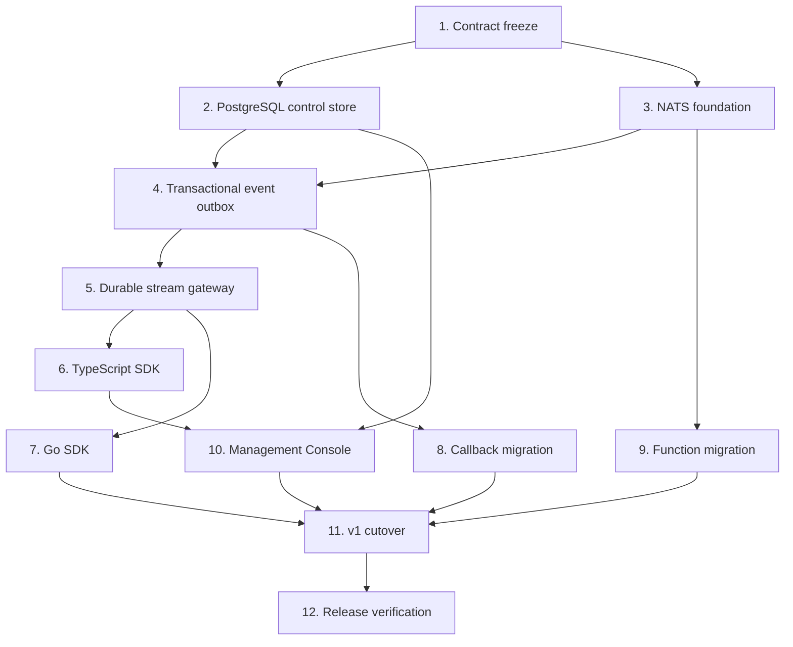

# RelayHub v1 NATS Platform Implementation Plan

> **Execution:** Use `superpowers:subagent-driven-development` or
> `superpowers:executing-plans`. Complete tasks in dependency order and require a
> spec review plus code-quality review for every task. Apply strict TDD to runtime
> behavior. Documentation is part of each task.

**Goal:** Replace the Redis/custom-polling data plane with an internal
NATS/JetStream platform, add durable SDK consumption and a Management Console,
while completing the v1 HTTP, callback and function contracts.

**Design:** `docs/superpowers/specs/2026-09-12-relayhub-nats-platform-design.md`

**Target stack:** Go 1.27.1+, chi, Gorilla WebSocket, `nats.go`, JetStream,
PostgreSQL, `pgx`, SQL migrations, React + TypeScript + Vite, TypeScript and Go
SDKs, OpenAPI 3.1, AsyncAPI, JSON Schema, Docker Compose.

## Delivery rules

- The public origin remains `https://relayhub.dungxbuif.com`.
- Only RelayHub HTTP port 8080 is published.
- NATS and PostgreSQL remain private.
- No raw subject, stream, consumer or sequence is part of the public API.
- Application business code must not implement polling.
- `/api/v1/queue` is removed before the v1 release candidate.
- Callback HMAC and HTTP application signing retain their documented v1 contracts.
- Browser code never receives an application HMAC secret.
- Every behavior change updates internal docs, public docs and agent-readable
  artifacts in the same commit.
- Every phase must leave the repository buildable and its focused tests green.

## Dependency graph



---

## Task 1 — Freeze v1 contracts and build test fixtures

**Purpose:** Prevent the NATS implementation from leaking broker details or
silently changing existing behavior.

**Create:**

- `docs/architecture/adr/0001-nats-private-data-plane.md`
- `docs/architecture/adr/0002-postgres-transactional-outbox.md`
- `docs/developer/streaming-protocol.md`
- `public-docs/developer/streaming-protocol.md`
- `public-docs/asyncapi.yaml`
- `public-docs/schemas/stream-client-frame.schema.json`
- `public-docs/schemas/stream-server-frame.schema.json`
- `internal/streamprotocol/fixtures/*.json`

**Modify:** OpenAPI, route manifest, contract checker, `llms-full`, Skill sources
and the design spec if review changes a decision.

**Steps:**

1. Record ADRs for private NATS, PostgreSQL outbox, one default durable consumer,
   same-origin streaming gateway and removal of public queue polling.
2. Define versioned handshake, delivery, ACK, NACK, progress, function and error
   frames in JSON Schema and AsyncAPI.
3. Define stable error codes and close codes.
4. Add positive/negative fixtures for every frame, including duplicate keys,
   invalid UTF-8, wrong ownership, oversize messages and unsupported versions.
5. Extend drift checks so docs/AsyncAPI/schemas/fixtures must agree.

**Verification:**

```bash
go test ./internal/streamprotocol ./web -count=1
python3 scripts/check-docs.py
./scripts/check-contracts.sh --self-test
```

**Exit:** All protocol decisions are reviewable before transport code exists.

---

## Task 2 — Add PostgreSQL control state and migrations

**Purpose:** Preserve transactional application/event/idempotency semantics while
NATS handles messaging.

**Create:**

- `internal/store/postgres/client.go`
- `internal/store/postgres/migrations/*.sql`
- `internal/store/postgres/apps.go`
- `internal/store/postgres/apps_integration_test.go`
- `internal/store/postgres/functions.go`
- `internal/store/postgres/audit.go`
- `internal/crypto/secrets.go`

**Schema:**

- `applications`
- `application_credentials`
- `callback_endpoints`
- `functions`
- `admin_sessions`
- `audit_log`
- migration ledger

**Steps:**

1. Add PostgreSQL configuration with credential-safe diagnostics and bounded
   connection pool settings.
2. Add forward-only migrations with advisory-lock serialization.
3. Port application CRUD, disabled state, partial-update CAS and credential
   rotation from Redis.
4. Encrypt callback-signing secrets at rest using a dedicated master key and
   versioned ciphertext format.
5. Preserve current API-key lookup and HMAC authentication behavior.
6. Implement append-only audit events without secret or request-body storage.
7. Add empty-database, upgrade, concurrent mutation and rollback tests.

**Verification:**

```bash
go test ./internal/store/postgres ./internal/service ./internal/auth -count=1
go test -race -tags=integration ./internal/store/postgres -count=1
```

**Exit:** Application/auth/function control paths run on PostgreSQL with no Redis
dependency and all existing HTTP contract tests pass.

---

## Task 3 — Bootstrap private NATS and JetStream

**Purpose:** Establish a reproducible, private messaging data plane before moving
traffic.

**Create:**

- `internal/broker/broker.go`
- `internal/broker/nats/client.go`
- `internal/broker/nats/bootstrap.go`
- `internal/broker/nats/subjects.go`
- `internal/broker/nats/*_integration_test.go`
- `deploy/nats/nats.conf`

**Modify:** configuration, readiness, metrics, Compose, runbook and security docs.

**Steps:**

1. Add `nats.go` and typed broker interfaces for publish, consume, ACK/NACK,
   request/reply and stream inspection.
2. Generate internal subject tokens from opaque app IDs; reject client-provided
   subjects at every boundary.
3. Bootstrap `RH_DELIVERIES`, `RH_CALLBACKS` and `RH_DLQ` idempotently with exact
   retention, storage and duplicate-window settings.
4. Validate existing stream configuration instead of silently mutating unsafe
   differences.
5. Add reconnect, unavailable server, slow-consumer and graceful drain metrics.
6. Add NATS health/readiness and JetStream configuration checks.
7. Configure file-backed JetStream volume, account permissions and private ports.

**Verification:**

```bash
go test -race -tags=integration ./internal/broker/nats -count=1
docker compose config --quiet
```

**Exit:** RelayHub can bootstrap, reconnect and drain against a real NATS server;
no application can connect to NATS from outside the project network.

---

## Task 4 — Implement transactional event acceptance and outbox dispatch

**Purpose:** Preserve `202` durability without relying on cross-message NATS
transactions.

**Create:**

- `internal/store/postgres/events.go`
- `internal/store/postgres/outbox.go`
- `internal/outbox/dispatcher.go`
- focused unit/integration tests

**Schema additions:**

- `events`
- `event_idempotency`
- `deliveries`
- `delivery_attempts`
- `outbox`

**Steps:**

1. Write RED tests for atomic event, target delivery and outbox insertion.
2. Preserve strict UTF-8/JSON-object validation and raw JSON number bytes.
3. Reserve producer/idempotency key in the same transaction and replay the exact
   original response.
4. Create independent stream/callback delivery rows per enabled sink.
5. Dispatch outbox rows with deterministic `Nats-Msg-Id` values.
6. Lock batches with `FOR UPDATE SKIP LOCKED`; bound attempts and stale claims.
7. Reconcile crash windows: before publish, after publish/before DB update, and
   after DB update.
8. Add outbox lag/readiness/metrics and payload-free logs.

**Verification:**

```bash
go test -race ./internal/outbox ./internal/service -count=1
go test -race -tags=integration ./internal/store/postgres ./internal/broker/nats -count=1
```

**Exit:** Killing RelayHub at every dispatch boundary neither loses an accepted
event nor creates a user-visible duplicate delivery identity.

---

## Task 5 — Build the durable streaming gateway

**Purpose:** Replace application-managed polling with server delivery and explicit
ACK/NACK over one persistent SDK connection.

**Create:**

- `internal/streamgateway/gateway.go`
- `internal/streamgateway/session.go`
- `internal/streamgateway/assignment.go`
- `internal/httpapi/stream.go`
- unit, protocol, integration and real-socket tests

**Steps:**

1. Authenticate the short-lived token before upgrade and bind app identity.
2. Accept only protocol version and the server-owned `default` consumer.
3. Bind all replicas of one app to the same durable JetStream consumer.
4. Deliver bounded batches with per-session message/byte and max-in-flight limits.
5. Map ACK/NACK/progress to the exact assigned JetStream message and PostgreSQL
   delivery record.
6. Reject cross-app, stale, duplicate and unassigned acknowledgements.
7. Drain safely on shutdown; unacked messages redeliver after disconnect.
8. Reconnect to NATS without losing client connection where feasible; otherwise
   close with a retryable stable code.
9. Add backpressure, slow-handler, malformed-frame and Unicode boundary tests.

**Verification:**

```bash
go test -race ./internal/streamprotocol ./internal/streamgateway ./internal/httpapi -count=1
go test -race -tags=integration ./internal/streamgateway -count=1
```

**Exit:** A handler receives continuous durable deliveries without HTTP polling;
two replicas share work; failure before ACK redelivers.

---

## Task 6 — Publish the TypeScript SDK

**Create:**

- `sdk/typescript/package.json`
- `sdk/typescript/src/http/*`
- `sdk/typescript/src/stream/*`
- `sdk/typescript/src/functions/*`
- `sdk/typescript/src/browser.ts`
- `sdk/typescript/src/node.ts`
- tests, examples and generated API reference

**Public API:**

```ts
new RelayHubClient(options)
client.events.publish(input, { idempotencyKey })
client.events.consume(handler, options)
client.events.observe(handler)
client.functions.handle(name, handler)
client.functions.invoke(id, input, options)
client.close({ drain: true })
```

**Steps:**

1. Split browser and Node exports so secret signing cannot enter browser bundles.
2. Implement exact HMAC canonicalization from fixed cross-language fixtures.
3. Implement streaming state machine, jittered reconnect, token refresh callback,
   ACK-on-success, NACK-on-error, concurrency and graceful drain.
4. Expose typed handler context with event/delivery IDs and attempt number.
5. Add deterministic fake-clock/network tests and real RelayHub contract
   tests.
6. Produce ESM/CJS/types, package provenance metadata and a size budget.

**Verification:**

```bash
npm --prefix sdk/typescript ci
npm --prefix sdk/typescript test
npm --prefix sdk/typescript run typecheck
npm --prefix sdk/typescript run build
```

**Exit:** The documented consumer example contains no polling, lease or reconnect
code and passes a real redelivery test.

---

## Task 7 — Publish the Go SDK

**Create:**

- `sdk/go/client.go`
- `sdk/go/events.go`
- `sdk/go/consumer.go`
- `sdk/go/functions.go`
- examples and tests

**Public API:**

```go
client.Publish(ctx, event, relayhub.IdempotencyKey(key))
consumer, err := client.Consume(ctx, handler, relayhub.MaxInFlight(16))
consumer.Drain(ctx)
client.HandleFunction(ctx, "calculate", handler)
client.Invoke(ctx, functionID, input, relayhub.IdempotencyKey(key))
```

**Steps:**

1. Implement canonical signing from the same language-neutral fixtures.
2. Use one reader and one writer path for WebSocket safety.
3. Bound goroutines, queues, reconnect and shutdown.
4. ACK only after a nil handler result; convert typed retry errors to NACK delay.
5. Preserve cancellation without leaking goroutines or silently ACKing work.
6. Run contract tests against the same server scenarios as TypeScript.

**Verification:**

```bash
go test -race ./sdk/go/... -count=1
```

**Exit:** Go services integrate with a handler and context, without broker or poll
management.

---

## Task 8 — Move callback delivery to JetStream

**Purpose:** Remove Redis Streams, retry sorted sets and custom reclaim logic while
retaining the callback contract.

**Steps:**

1. Consume `RH_CALLBACKS` with explicit ACK and bounded worker concurrency.
2. Revalidate callback eligibility and credential version immediately before
   dispatch.
3. Preserve exact body/signature headers, redirect policy and bounded body drain.
4. Map retry classification to delayed NACK or a durable retry scheduler where
   server capability requires it.
5. Persist every attempt and terminal transition in PostgreSQL idempotently.
6. Publish exhausted/permanent failures to `RH_DLQ` and mark the delivery in the
   same reconciled workflow.
7. Port crash, stale-worker, callback-change, queue-interaction and Retry-After
   tests.

**Verification:**

```bash
go test -race ./internal/delivery ./internal/worker -count=1
go test -race -tags=integration ./internal/worker -count=1
```

**Exit:** All callback contract cases pass with Redis stopped.

---

## Task 9 — Move realtime and functions to Core NATS

**Purpose:** Replace Redis Pub/Sub and custom cross-instance RPC coordination.

**Steps:**

1. Publish best-effort observation notifications to app-scoped Core NATS subjects.
2. Bridge `/ws` and SDK `observe()` without exposing subjects.
3. Route function calls through NATS request/reply with one eligible owner gateway.
4. Preserve function registration, ownership, timeout and caller idempotency in
   PostgreSQL.
5. Fence replies by app, connection, invocation and deadline.
6. Preserve no-redispatch-after-accepted semantics and stored terminal replay.
7. Test two gateway instances, multiple owner sessions, disconnect races, fast
   replies, no responders and timeout boundaries.

**Verification:**

```bash
go test -race ./internal/realtime ./internal/service ./internal/httpapi -count=1
go test -race -tags=integration ./internal/realtime ./internal/service -count=1
```

**Exit:** WebSocket observation and functions operate with Redis unavailable and
retain the documented external behavior.

---

## Task 10 — Build the Management Console

**Create:**

- `console/package.json`
- `console/src/*`
- `internal/httpapi/admin_session.go`
- `internal/httpapi/console.go`
- UI/API/browser tests

**Routes:**

- `/console/`
- `POST /api/v1/admin/session`
- `DELETE /api/v1/admin/session`
- existing/new admin JSON resources needed by console

**Steps:**

1. Build a React/Vite SPA and embed its deterministic output in the Go binary.
2. Exchange bootstrap admin token for a secure session cookie; add CSRF defense,
   idle/absolute expiry and logout.
3. Implement application list/create/edit/disable/rotate.
4. Show credentials once with copy, explicit acknowledgement and `.env` download.
5. Add event/delivery/DLQ inspection and requeue actions.
6. Add function management and per-app SDK snippets.
7. Add accessible keyboard/focus/error/loading/empty states and responsive layouts.
8. Prevent secrets from analytics, logs, URL, browser persistence and error reports.

**Verification:**

```bash
npm --prefix console ci
npm --prefix console test
npm --prefix console run build
go test ./internal/httpapi ./web -count=1
```

Run real Chrome at desktop and mobile viewports for create/copy/download/rotate,
event inspection, DLQ requeue, keyboard navigation and expired-session recovery.

**Exit:** An operator can create an app, obtain credentials once and complete the
SDK quickstart without calling admin curl manually.

---

## Task 11 — Cut over v1 APIs and remove Redis runtime

**Purpose:** Make NATS/PostgreSQL authoritative and remove development-only Redis
and polling paths before v1 is released.

**Steps:**

1. Route all v1 app/event/job/function queries to PostgreSQL.
2. Prove streaming ACK/NACK is fenced by app, connection and delivery and cannot
   double-complete a delivery.
3. Remove the `/api/v1/queue` route, handlers and polling-specific tests.
4. Remove Redis construction, Streams/PubSub packages, config and Compose service.
5. Add upgrade documentation; because there is no deployed Redis-backed release,
   explicitly fail on an unexpected Redis migration request instead of pretending
   to migrate unsupported data.
6. Remove queue polling from OpenAPI and public docs, retaining a development
   migration note only in internal documentation.
7. Make all examples and Skills SDK-first streaming.

**Verification:**

```bash
go test -race ./... -count=1
go test -race -tags=integration ./... -count=1 -timeout=240s
rg 'go-redis|RELAYHUB_REDIS|redisstore' --glob '!docs/reviews/**' --glob '!docs/superpowers/**'
```

The final search must contain only deliberate migration history or return no
runtime references.

**Exit:** Starting RelayHub requires PostgreSQL and NATS only; every mandatory
feature passes with no Redis process available.

---

## Task 12 — Documentation, security and release verification

**Purpose:** Prove the complete product flow, not just package-level completion.

**Create/update:**

- `docs/reviews/V1-VERIFICATION.md`
- console/operator runbook
- NATS/PostgreSQL backup/restore/upgrade guides
- SDK quickstarts and references
- OpenAPI, AsyncAPI, schemas, Skills, `llms.txt`, `llms-full.txt`
- CI and full E2E scripts

**Required acceptance journeys:**

1. Console login → create producer/consumer → download one-time credentials.
2. TypeScript publish → Go handler receives → automatic ACK.
3. Handler failure → NACK/redelivery → later success.
4. Two replicas share 100 messages exactly once per successful ACK.
5. Kill consumer before ACK → message redelivers.
6. Restart RelayHub, NATS and PostgreSQL independently → accepted event survives.
7. Callback transient retry, permanent failure, DLQ inspection and console requeue.
8. Function success, handler error, unavailable, timeout and idempotent replay.
9. Cross-app subscribe/ACK/function reply attempts fail without data leakage.
10. No public queue polling route or Redis runtime dependency remains.

**Full gate:**

```bash
test -z "$(gofmt -l .)"
go vet ./...
go test ./... -count=1
go test -race ./... -count=1
go test -race -tags=integration ./... -count=1 -timeout=240s
npm --prefix sdk/typescript ci
npm --prefix sdk/typescript test
npm --prefix sdk/typescript run build
npm --prefix console ci
npm --prefix console test
npm --prefix console run build
./scripts/build-skill.sh --check
./scripts/build-llms.sh --check
python3 scripts/check-docs.py
./scripts/check-contracts.sh --self-test
docker build --platform linux/arm64 -t relayhub:v1-arm64 .
docker build --platform linux/amd64 -t relayhub:v1-amd64 .
docker compose config --quiet
./scripts/e2e-v1.sh
./scripts/e2e-v1.sh --backup-rehearsal
```

Also run vulnerability, secret, dependency-license, log-redaction and container
hardening scans. Mandatory suites may not skip because a dependency is absent; CI
must provide explicit NATS and PostgreSQL services.

**Exit:** The verification matrix contains no FAIL or UNVERIFIED feature row; all
public and agent-readable artifacts match the shipped server and SDKs.

---

## Milestones and review points

| Milestone | Tasks | Reviewable outcome |
| --- | --- | --- |
| M1 Foundation | 1–3 | Approved protocol, PostgreSQL store and private NATS |
| M2 Durable delivery | 4–5 | Event outbox and non-polling streaming consumer |
| M3 Developer integration | 6–7 | TypeScript and Go SDKs |
| M4 Feature parity | 8–9 | Callback, realtime and functions on NATS |
| M5 Product surface | 10 | Management Console and one-time credentials |
| M6 Cutover | 11–12 | Redis/polling removed, v1 contract verified, docs complete |

Do not begin M2 until M1 architecture and protocol review pass. Do not begin the
console beyond static shells until admin-session security and SDK public APIs are
approved. Do not remove Redis until callback/function/v1 parity and failure-window
tests pass.

## Estimated implementation order

The critical path is Task 1 → 2/3 → 4 → 5 → 6/7 → 8/9 → 10 → 11 → 12.
Tasks 2 and 3 can run in parallel. SDKs can run in parallel after the streaming
protocol is stable. Callback and function migrations can run in parallel after
their dependencies are ready. All work converges at the v1 cutover and the
release verification gate.
