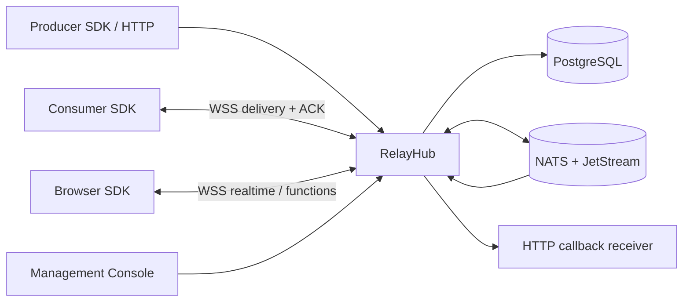

# RelayHub NATS Platform Design

**Status:** Draft for review  
**Milestone:** v0.2 — managed messaging platform  
**Supersedes for new work:** Redis transport and client-managed queue polling in the v0.1 MVP  
**Keeps:** existing application identity, HMAC HTTP API, event envelope, callback verification, public origin, docs and security rules

## Goal

RelayHub becomes the single messaging provider used by applications in the
homelab. Application business code registers a handler through an official SDK;
it does not implement a polling loop, Redis/Kafka/NATS configuration, lease
renewal, reconnect, backoff or acknowledgement state.

NATS and JetStream are the internal data plane. They are not exposed as the
default public integration contract. RelayHub owns subjects, streams, durable
consumers, acknowledgements, retries and authorization. The public integration
surface remains one origin:

```text
https://relayhub.dungxbuif.com
wss://relayhub.dungxbuif.com/api/v2/stream
```

## Why the v0.1 queue changes

The v0.1 endpoint `GET /api/v1/queue?wait=30` is HTTP long polling. It is bounded
and reliable, but it exposes too much worker lifecycle to each application. Hiding
that endpoint behind an SDK would improve ergonomics without changing the data
plane, but would leave RelayHub maintaining custom queue, Pub/Sub and distributed
claim logic.

JetStream already provides durable consumers, explicit acknowledgement,
redelivery, flow control and continuous consumption. Official NATS clients keep
pull requests in flight for continuous consumers, so service code receives a
handler callback rather than writing a fetch loop. Core NATS also supplies
publish/subscribe, queue groups and request/reply. RelayHub should build its
product contracts around those primitives instead of recreating them.

## Product boundary

### Included in v0.2

1. A web Management Console for application and credential lifecycle.
2. TypeScript and Go SDKs for signing, publishing, durable consumption and
   function handling.
3. A persistent RelayHub streaming protocol with server delivery and client
   ACK/NACK frames.
4. JetStream-backed durable event delivery, redelivery and dead-letter handling.
5. Core NATS-backed realtime observation and remote function request/reply.
6. PostgreSQL transactional state for applications, credentials, events,
   deliveries, idempotency, callbacks, functions and audit records.
7. Compatibility adapters for the existing v1 HTTP publish, callback, function
   and queue endpoints during one deprecation window.
8. Human docs, OpenAPI, AsyncAPI, JSON Schema, SDK references, `llms.txt`, Skills
   and copyable integration examples.

### Deferred

- Native public NATS credentials and direct `nats://` client access.
- Kafka wire compatibility.
- Multiple durable consumer groups per target application. v0.2 supplies one
  application-owned `default` consumer whose replicas share work.
- Multi-region federation.
- Public SaaS billing and organization tenancy.
- Visual workflow building.
- Arbitrary user code execution.

## Target architecture



The deployable cluster contains three services:

1. `relayhub`: Go API, streaming gateway, embedded React console/docs, outbox
   dispatcher, callback delivery and function bridge.
2. `relayhub-nats`: private NATS server with JetStream file storage.
3. `relayhub-postgres`: private PostgreSQL instance with a persistent volume.

Only RelayHub port 8080 is published. External Traefik routes the whole origin to
that port. NATS and PostgreSQL are private to the RelayHub network. The Go process
may later be split into API/worker deployments without changing client contracts.

## Control plane

### Administrator session

`RELAYHUB_ADMIN_TOKEN` remains the bootstrap credential. The console exchanges it
once through `POST /api/v2/admin/session` for an encrypted, `HttpOnly`, `Secure`,
`SameSite=Strict` session cookie. The raw bootstrap token is never stored in
browser storage. Sessions have a bounded idle and absolute lifetime and can be
revoked by rotating the bootstrap token or session signing key.

### Application credentials

Application creation and rotation return credentials once. PostgreSQL stores:

- Application ID, name, enabled state and timestamps.
- API key identifier plus Argon2id or SHA-256 lookup material as appropriate.
- HMAC secret encrypted at rest with a dedicated master key because RelayHub
  needs the plaintext secret to sign callbacks.
- Callback endpoints and delivery policy.
- Credential version and revocation timestamp.

The existing v1 HMAC request signature remains accepted. SDKs implement it so
application code does not duplicate canonicalization.

### Console scope

The first console release supports:

- Create, list, inspect, update, disable and rotate applications.
- One-time credential modal with copy and `.env` download.
- Configure callback endpoint and stream/callback delivery policy.
- Inspect events and per-sink deliveries.
- Inspect and requeue dead-letter deliveries.
- Register/delete remote functions.
- View generated Go, TypeScript and curl snippets for the selected app.
- Read-only metrics/health summary and audit trail.

## Event and delivery model

### Transactional acceptance

PostgreSQL is the source of truth for API acceptance. In one database transaction,
RelayHub writes:

- The canonical event.
- The producer-scoped idempotency record.
- One delivery row per target and enabled sink (`stream`, `callback`).
- One outbox row per JetStream publication.

The API returns `202 Accepted` after this transaction commits. An outbox worker
publishes each row to JetStream with a deterministic NATS message ID. A crash
between database commit and NATS publish is recovered by replaying unsent outbox
rows; duplicate publishes are suppressed by the deterministic ID and reconciled
against delivery state.

### Subjects and streams

Subject names are internal and never accepted from clients:

```text
rh.v2.delivery.<app_token>
rh.v2.realtime.<app_token>
rh.v2.callback.<shard>
rh.v2.rpc.<app_token>.<function_token>
rh.v2.rpc.reply.<instance_token>
```

Opaque NATS-safe tokens are derived server-side. User event types remain data and
do not become unrestricted subject fragments.

JetStream streams:

| Stream | Subjects | Purpose |
| --- | --- | --- |
| `RH_DELIVERIES` | `rh.v2.delivery.*` | Durable SDK delivery |
| `RH_CALLBACKS` | `rh.v2.callback.*` | Durable callback dispatch |
| `RH_DLQ` | `rh.v2.dlq.*` | Terminal delivery inspection/requeue |

Each application gets one durable consumer identity, `default`. Multiple SDK
instances bind to the same consumer and share messages. Server settings enforce
explicit ACK, ACK wait, maximum delivery count, maximum pending messages and
bounded batch sizes.

### Delivery state

PostgreSQL records delivery state for console/API queries:

```text
pending -> dispatched -> acked
                     -> retrying -> dispatched
                     -> dead_letter
```

JetStream consumer state controls transport redelivery. PostgreSQL state records
the product history. Updates are idempotent by delivery ID and NATS stream
sequence. Reconciliation detects a message acknowledged in NATS before the
database state update and repairs the query model.

### Compatibility queue endpoint

`GET /api/v1/queue` remains for one release as an adapter over the same `default`
JetStream consumer. It is deprecated and never used by the official SDK. ACK via
v1 and ACK via the streaming protocol converge on the same delivery state.

## Streaming protocol

### Connection

The SDK obtains a short-lived app-scoped token from the existing signed token
endpoint, then opens:

```text
wss://relayhub.dungxbuif.com/api/v2/stream?token=<token>
```

Browser origin allowlisting, complete-message limits, ping/pong, bounded queues
and graceful shutdown follow the existing WebSocket security rules.

### Client frames

```json
{"type":"consumer.start","consumer":"default","topics":["order.created"],"max_in_flight":16}
{"type":"delivery.ack","delivery_id":"dlv_..."}
{"type":"delivery.nack","delivery_id":"dlv_...","delay_ms":5000}
{"type":"delivery.progress","delivery_id":"dlv_..."}
{"type":"function.result","invocation_id":"inv_...","ok":true,"result":{}}
{"type":"ping"}
```

### Server frames

```json
{"type":"ready","app_id":"app_...","connection_id":"conn_..."}
{"type":"consumer.started","consumer":"default"}
{"type":"event.delivery","delivery_id":"dlv_...","attempt":1,"event":{}}
{"type":"delivery.accepted","delivery_id":"dlv_...","state":"acked"}
{"type":"function.invoke","invocation_id":"inv_...","function":"calculate","input":{},"deadline":"..."}
{"type":"error","code":"...","message":"..."}
```

The gateway binds the authenticated app to its internal durable consumer. It
never accepts an app ID, subject, stream or durable name chosen by the client.
ACK/NACK is valid only for a delivery currently assigned to that connection and
application. Reconnect uses server-side consumer state; no client offset is
trusted.

### SDK handler semantics

```ts
await client.events.consume(async event => {
  await handle(event.data);
});
```

- Resolve normally: SDK sends ACK.
- Throw/reject: SDK sends NACK with bounded backoff.
- Process exits or connection drops: ACK wait expires and JetStream redelivers.
- Handler exceeds its configured processing deadline: SDK sends progress only
  within a server-bounded maximum; otherwise redelivery occurs.
- SDK supplies concurrency, graceful drain, reconnect with jitter and duplicate
  delivery IDs to the handler context.

Delivery remains at least once. Business handlers must use `event.id` or
`delivery_id` for application-level idempotency.

## Realtime WebSocket

The existing `/ws` contract remains during migration for best-effort observation.
Its event notifications move from Redis Pub/Sub to Core NATS. Durable business
processing uses `/api/v2/stream`, not `/ws` event hints.

The TypeScript browser SDK wraps the standard WebSocket protocol; no Socket.IO
compatibility is added.

## Callback delivery

Callback signing, response classification and retry schedule stay compatible.
Callback work moves to `RH_CALLBACKS` with explicit ACK and delayed NACK/retry.
PostgreSQL stores attempts and terminal state. A callback `2xx` ACKs its NATS
message; permanent `4xx` or exhausted retries publish a deterministic DLQ message
and atomically mark the delivery dead-lettered.

The existing schedule remains:

```text
initial attempt, then 1s, 5s, 15s, 60s, 300s; DLQ after the sixth failure
```

## Remote functions

HTTP registration, invocation and idempotency stay compatible. Internal routing
moves to Core NATS request/reply:

1. The caller transaction reserves the invocation/idempotency record.
2. RelayHub requests the owner function subject with the registered deadline.
3. One gateway instance with an eligible owner session receives the request.
4. The session receives `function.invoke` and responds on the same connection.
5. The gateway validates ownership and publishes to the NATS reply inbox.
6. RelayHub stores the terminal result before answering/replaying to HTTP callers.

No responder produces `503 function_unavailable`; an accepted but unfinished
invocation produces `504 function_timeout`. Functions remain online-only and are
not placed in the durable delivery stream.

## SDKs

### TypeScript package

```text
@relayhub/sdk
```

Supports Node 20+ and modern browsers where applicable:

- `RelayHubClient` and typed configuration.
- HMAC-signed HTTP client for server runtimes.
- `events.publish()`.
- `events.consume()` with ACK/NACK, concurrency and graceful drain.
- `events.observe()` for best-effort browser updates.
- `functions.register()`, `functions.handle()` and `functions.invoke()`.
- Structured error classes, retry policy and OpenTelemetry hooks.

Browser builds accept only short-lived tokens. They exclude API-key/HMAC signing
code from the browser export.

### Go module

```text
github.com/dungxbuif/relayhub-go
```

The first implementation may live under `sdk/go` in the monorepo and be split
after contract stabilization. It exposes context-aware publish, consume, function
handler and drain APIs with no background goroutine leak.

### Versioning

- HTTP API: `/api/v1` remains compatible; new streaming control endpoints use
  `/api/v2`.
- Streaming protocol includes an explicit version in the handshake.
- SDKs follow semantic versioning and publish a compatibility matrix.
- JSON Schema and AsyncAPI are generated from the same protocol fixtures used by
  server and SDK tests.

## Reliability and security invariants

- Applications cannot select or subscribe to raw NATS subjects.
- NATS and PostgreSQL ports are not publicly exposed.
- Every durable message has deterministic identity and bounded retention.
- SDK ACK is accepted only from the assigned app/connection/delivery.
- HTTP acceptance survives RelayHub or NATS restart through the PostgreSQL outbox.
- Stream delivery survives consumer disconnect and RelayHub restart.
- Callback and stream sinks have independent terminal state.
- Credentials, tokens, NATS subjects, payloads and callback response bodies do not
  enter logs or metric labels.
- Backpressure bounds per-connection messages and bytes, per-consumer pending
  messages and total handler concurrency.
- Console mutations produce audit records without secrets.
- Database migrations are forward-only, transactional where PostgreSQL permits,
  and tested against empty and previous-version databases.

## Observability

Metrics add bounded families for:

- Outbox pending/age/publish outcomes.
- JetStream publish latency and errors.
- Active SDK consumers and in-flight deliveries.
- ACK/NACK/redelivery/DLQ outcomes.
- NATS reconnect and slow-consumer events.
- PostgreSQL transaction latency/errors.
- Console authentication and mutation outcomes.

Readiness checks PostgreSQL, NATS connectivity, JetStream stream configuration and
outbox lag threshold. Liveness remains process-only.

## Documentation outputs

Human documentation adds:

- Console administration.
- TypeScript and Go SDK quickstarts.
- Durable consumer semantics and idempotent handlers.
- Callback and function integration.
- Migration from v1 queue polling.
- NATS/PostgreSQL operations, backup, restore and upgrades.

Machine-readable outputs add:

- AsyncAPI for `/api/v2/stream`.
- JSON Schemas for every streaming frame.
- SDK API references and examples.
- Updated OpenAPI.
- `llms.txt`, `llms-full.txt` and integration Skills containing SDK-first flows.

## Migration and removal

No production deployment or persisted consumer data exists, so v0.2 uses a direct
infrastructure replacement. Compatibility is contractual rather than data-level:

1. Preserve v1 HTTP request/response shapes.
2. Replace Redis implementations behind service interfaces.
3. Keep v1 queue as a JetStream adapter for one release.
4. Make SDK streaming the documented default.
5. Remove Redis from Compose after parity tests pass.
6. Remove the v1 queue endpoint only in a later version with explicit migration
   notice; it is not removed in this milestone.

## Acceptance criteria

The milestone is complete only when:

1. A user creates an app in the console and downloads credentials once.
2. A TypeScript producer publishes and a Go consumer handler receives and ACKs
   without application polling code.
3. Two replicas of one consumer share work without duplicates while connected;
   unacked work redelivers after failure.
4. RelayHub restart, NATS restart and PostgreSQL restart preserve accepted work.
5. Callback retry/DLQ and remote functions pass compatibility tests.
6. An app cannot receive another app's event or reply to its function.
7. The v1 queue adapter and streaming SDK converge on the same state.
8. Console, SDK, OpenAPI, AsyncAPI, schemas, Skills and embedded docs pass drift
   checks.
9. Unit, race, PostgreSQL/NATS integration, browser, SDK compatibility and full
   three-service E2E gates pass with no skipped mandatory tests.

## Primary references

- [NATS JetStream continuous pull consumers](https://docs.nats.io/learn/jetstream/pull-consumers)
- [NATS WebSocket configuration](https://docs.nats.io/reference/config/websocket/)
- [Core NATS messaging patterns](https://docs.nats.io/learn/core-nats/)
- [NATS subject authorization](https://docs.nats.io/learn/security/authorization)

