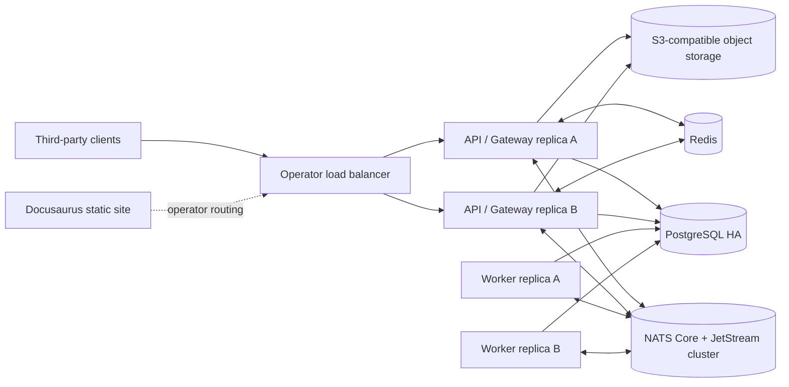

# RelayHub Platform Expansion Design

**Status:** Draft for final review  
**Date:** 2026-09-20  
**Baseline:** RelayHub v1 Core Engine and API on PostgreSQL, NATS JetStream,
signed callbacks, durable WebSocket streaming, realtime channels, Go SDK and
TypeScript SDK  
**Purpose:** Consolidate every product and architecture decision agreed during
the planning session into one reviewable source of truth

## 1. Executive decision

RelayHub will evolve from a complete v1 messaging engine with a basic static
console into a self-hosted integration platform with four first-class surfaces:

1. A Go backend that owns durable events, callback delivery, queue settlement,
   realtime fan-out, remote functions, administration and observability.
2. A React + TypeScript + Vite Admin application embedded in the Go binary.
3. A standalone Docusaurus documentation application for humans and AI agents.
4. Official Go and TypeScript SDKs with reproducible builds and automated
   packaging; TypeScript is published to npm.

The backend uses PostgreSQL as the durable source of truth, private NATS
JetStream/Core NATS as its delivery data plane, Redis as shared ephemeral state,
and S3-compatible storage for optional file payloads. Applications never receive
raw NATS or Redis credentials. Public integrations use HTTPS, signed callbacks,
standard RFC 6455 WebSockets, the durable stream protocol, and the Queue v2 HTTP
API.

Horizontal scaling is a day-one invariant rather than a later optimization. API
and worker replicas can be added independently without sticky sessions, local
authoritative state or singleton schedulers. Internal compatibility may be broken
and existing components may be replaced where necessary to satisfy this design.

Reverse-proxy implementation is explicitly outside this project. Documentation
will state the required route behavior, but no Nginx, Caddy, Traefik or other
proxy configuration will be created or maintained here.

Python is explicitly excluded. There will be no Python SDK, Python packaging,
Python examples treated as an official SDK, or Python CI workflow.

## 2. Current baseline

The current repository already provides:

- Go API and worker processes built from one image.
- PostgreSQL control state, events, deliveries, idempotency and append-only
  audit storage.
- Private NATS Core and JetStream delivery.
- Transactional event acceptance and outbox dispatch.
- Application credentials with admin bearer provisioning and app HMAC requests.
- Routing rules, durable event publication and event/job lookup.
- Signed callback delivery with retries and dead-letter transitions.
- Durable WebSocket streaming at `/api/v1/stream` with ACK/NACK and redelivery.
- Best-effort realtime channels at `/ws`.
- Remote functions over WebSocket.
- Prometheus metrics, structured logs, liveness and readiness.
- Go and TypeScript SDK source code.
- OpenAPI, AsyncAPI, JSON Schemas, `llms.txt`, `llms-full.txt` and an integration
  Skill archive.
- A basic static `console.html` that can call APIs and exercise a WebSocket.
- A partial Docusaurus site.

The following are not complete in the baseline:

- A production-grade Admin Dashboard.
- Public DLQ search and replay APIs.
- Event lifecycle and audit browsing APIs.
- Realtime charts and NATS status presentation.
- Fine-grained realtime channel authorization, unsubscribe, client publish,
  presence and connection targeting.
- HTTP batch-pull queue consumption.
- Stable standalone SDK packaging and npm publishing automation.
- A clean repository boundary between backend, web applications and SDKs.

## 3. Product scope

### 3.1 Included

- Repository reorganization into `backend/`, `web/` and `sdks/`.
- React/Vite Admin Dashboard embedded in the backend binary.
- Standalone Docusaurus public documentation under `web/docs/`.
- Dashboard charts for request rate, HTTP status, event/delivery outcomes,
  active WebSocket connections and NATS state.
- Searchable events, jobs, deliveries, attempts and audit records.
- DLQ inspection, single replay and batch replay.
- Event lifecycle timeline.
- Full Apps and Routing Rules management.
- Realtime Studio for standard and durable WebSocket protocols.
- Horizontal scaling for API, gateway and worker replicas from the first release
  of the expanded platform.
- Redis-backed distributed sessions, token revocation, rate limits, connection
  ownership, presence, occupancy, bounded realtime history and live aggregates.
- Realtime channel authorization, bidirectional publish, presence and targeting.
- Realtime history/rewind, controlled wildcard subscriptions and batch publish.
- End-to-end encrypted channels, message actions, file messages and push bridges.
- Queue v2 subscriptions with HTTP batch pull and explicit settlement.
- Queue v2 ordering keys, schedules, delay, deduplication, flow control,
  completion/failure callbacks and advanced DLQ operations.
- Go and TypeScript SDK updates for all public contracts.
- TypeScript SDK CI and npm trusted publishing.
- Official human docs, AI indexes, schemas and integration Skill packaging.
- Deterministic Admin asset generation and embedding.
- Full Go, frontend, docs, SDK, integration and container verification.

### 3.2 Deferred

- Multi-region federation.
- Billing and public SaaS organization tenancy.
- Arbitrary user-code execution.
- Exactly-once delivery claims across all transports.

### 3.3 Excluded

- Python SDK or Python package publishing.
- Direct public NATS access.
- Socket.IO protocol compatibility.
- Reverse-proxy implementation.
- Global broadcasts that cross application boundaries.
- A second durability mechanism inside realtime channels.

## 4. Target repository layout

```text
RelayHub/
├── backend/
│   ├── cmd/relayhub/
│   ├── internal/
│   ├── web/                       # Go embed package and generators
│   ├── scripts/
│   ├── deploy/nats/
│   ├── go.mod
│   └── go.sum
├── web/
│   ├── admin/                     # React + TypeScript + Vite
│   │   ├── src/
│   │   ├── tests/
│   │   ├── index.html
│   │   ├── package.json
│   │   └── vite.config.ts
│   └── docs/                      # Docusaurus public/official docs
│       ├── docs/
│       ├── static/
│       ├── src/
│       ├── package.json
│       └── docusaurus.config.ts
├── sdks/
│   ├── go/
│   │   ├── go.mod
│   │   └── *.go
│   └── typescript/
│       ├── src/
│       ├── test/
│       └── package.json
├── docs/                          # Internal architecture and operations
├── .github/workflows/
├── go.work
├── Dockerfile
├── compose.yaml
├── .dockerignore
└── README.md
```

Repository-root Docker and Compose files remain at the root because their build
context spans backend code, Admin assets and documentation validation. Application
source code itself is moved into the three bounded top-level directories.

The backend keeps module path `github.com/dungxbuif/RelayHub` to avoid rewriting
all internal imports. The standalone Go SDK uses the repository-aligned module
path `github.com/dungxbuif/RelayHub/sdks/go`; this is an intentional pre-1.0 SDK
path migration and all docs/examples are updated in the same release. A root
`go.work` includes both modules for local development.

## 5. Horizontal scale architecture

### 5.1 Runtime topology



API/gateway replicas are stateless except for the sockets physically attached to
that process. Their ownership and discoverable metadata are mirrored in Redis
with TTLs. Core NATS carries cross-instance realtime frames and instance-directed
control messages. Worker replicas share JetStream durable consumers and claim
durable PostgreSQL transitions with fencing tokens.

The local Compose profile runs one instance of each dependency for development.
Production documentation requires independently scalable API and worker groups,
a PostgreSQL HA service, a three-replica JetStream configuration, Redis Cluster
or a managed Redis-compatible service, and S3-compatible storage when file
messages are enabled. Redis Sentinel is permitted for smaller non-sharded HA
installations; Redis Cluster is the target for horizontal keyspace scaling.

### 5.2 Storage ownership

| Concern | Authoritative system | Notes |
| --- | --- | --- |
| Apps, credentials, routing, events, deliveries, attempts, subscriptions, schedules, audit | PostgreSQL | Durable transactional truth. |
| Outbox transport, durable delivery, callback work, queue wakeups | NATS JetStream | Private broker with explicit ACK and replicated streams. |
| Realtime cross-instance fan-out and gateway commands | Core NATS | Ephemeral transport; missed hints recover from authoritative state where applicable. |
| Admin sessions and CSRF state | Redis | TTL-bound and revocable across all API replicas. |
| Socket ownership and connection metadata | Redis | TTL-bound; the local gateway still owns the actual socket. |
| Presence and occupancy | Redis + Core NATS | Redis is the current shared view; Core NATS emits changes. |
| Channel history/rewind | Redis Streams | Bounded by time, count and bytes; never a durable work queue. |
| Distributed rate limits and quotas | Redis | Atomic token/sliding bucket operations. |
| Token revocation and one-time nonces | Redis | TTL never exceeds token lifetime. |
| Short rolling dashboard aggregates | Redis | External Prometheus remains the long-retention option. |
| Files | S3-compatible object storage | PostgreSQL stores metadata; signed URLs carry bytes directly. |

Redis never becomes the source of truth for an event, delivery, queue settlement,
credential, routing rule, subscription policy, schedule definition or audit
record. Redis loss may end sessions and erase ephemeral presence/history, but it
must not lose accepted durable work.

### 5.3 Redis data model

Redis keys use a deployment prefix and cluster hash tags so every atomic script
touches one slot. Representative key families are:

```text
rh:{session:<id>}:admin
rh:{app:<appID>}:rate:<dimension>
rh:{app:<appID>}:connections
rh:{connection:<connectionID>}:owner
rh:{channel:<appID>:<channel>}:presence
rh:{channel:<appID>:<channel>}:history
rh:{token:<jti>}:revoked
rh:{metrics:<bucket>}:dashboard
rh:{instance:<instanceID>}:heartbeat
```

Lua/functions implement atomic rate-limit, presence and session transitions.
Cross-slot transactions are forbidden. Large scans are forbidden on request
paths; indexes are explicit sets or sorted sets with bounded pagination. Every
ephemeral key has a documented TTL or bounded trim policy.

Redis Streams store realtime history with server-generated IDs and approximate
bounded trimming. They do not use consumer groups for application work; Queue v2
continues to use PostgreSQL/JetStream settlement semantics.

### 5.4 Connection routing

Each API replica owns a unique instance ID and publishes a heartbeat. On socket
acceptance it registers `connection -> instance` in Redis with a TTL renewed by
the heartbeat loop. Direct connection/client targeting resolves owners from Redis
and sends a command on an instance-scoped Core NATS subject. The owning replica
validates app/channel identity again before writing to the local socket.

Broadcast does not enumerate every connection in Redis. It publishes one
application/channel frame through Core NATS and each API replica fans out only to
its local matching sessions. This keeps broadcast cost proportional to gateway
replicas plus local subscribers rather than global connections.

Graceful drain marks an instance draining, rejects new sockets, removes or expires
its ownership records, NACKs uncommitted durable work and closes sockets with a
reconnectable code. Abrupt death is reconciled by TTL expiry.

### 5.5 Scheduler and worker scaling

There is no singleton in-memory scheduler. Scheduled Queue v2 rows live in
PostgreSQL. Replicas claim due rows with bounded `FOR UPDATE SKIP LOCKED` batches
and fencing tokens, publish deterministic JetStream message IDs, then persist the
outcome. Duplicate scheduler attempts are harmless.

Callback and queue workers scale as competing JetStream consumers. Every external
effect is protected by persisted attempt/generation tokens. Concurrency and rate
policies are shared through Redis, while the durable transition remains in
PostgreSQL.

### 5.6 Dependency failure policy

- PostgreSQL unavailable: durable reads/writes fail, readiness fails and no new
  durable work is accepted.
- NATS unavailable: readiness fails for realtime/worker service; accepted
  PostgreSQL outbox rows remain recoverable and dispatch resumes after reconnect.
- Redis unavailable: readiness fails; new sessions, socket admissions, realtime
  publish, Queue v2 pull and other quota-sensitive operations fail closed with a
  retryable response. Existing durable callback/JetStream workers continue where
  their persisted transition does not require Redis policy acquisition.
- Object storage unavailable: file operations fail independently; events, queue,
  webhook and non-file realtime operations remain available.
- One API replica unavailable: clients reconnect through the load balancer;
  instance ownership expires and no durable work is lost.

Liveness reports process health only. Readiness reports required dependency state
for the command being run. Dependency errors use bounded backoff and jitter and
never log credentials or raw payloads.

### 5.7 Scale invariants

- No correctness decision depends only on process memory.
- No sticky load-balancer session is required.
- Every background claim has an expiry and fencing token.
- Every public retryable write has an idempotency key or deterministic message ID.
- Broadcast is application-scoped and does not enumerate the global connection
  set.
- Redis operations on request paths are bounded and cluster-slot safe.
- Database pools, NATS pending limits, Redis pools and socket queues have explicit
  per-replica bounds.
- Adding replicas cannot multiply a scheduled action or callback side effect.
- Removing or crashing a replica cannot permanently strand a lease or presence
  member.

### 5.8 Alternatives considered

**Selected — Redis for shared ephemeral state, PostgreSQL for durable truth and
NATS for delivery.** This keeps each system aligned with its strengths: Redis
supports distributed rate limits and TTL state, Redis Streams support bounded
append/read/trim history, PostgreSQL protects transactional product state, and
JetStream protects durable transport. Redis documents atomic distributed rate
limiting and bounded Streams operations as primary use cases:
[rate limiting](https://redis.io/docs/latest/develop/use-cases/rate-limiter/) and
[Streams](https://redis.io/docs/latest/develop/data-types/streams/).

**Rejected — put durable queue and event state back into Redis.** This would
duplicate JetStream consumer/ACK behavior, weaken PostgreSQL transaction and audit
boundaries, and make Redis failover/data-loss semantics part of accepted-event
correctness.

**Rejected — keep only PostgreSQL and NATS.** It could scale with more custom
tables, leases and fan-out code, but shared sessions, high-frequency presence,
per-request quotas and short history would put avoidable write pressure on the
durable database. Process-local alternatives would require sticky sessions and
would not enforce cluster-wide limits.

Production Redis uses Cluster or a managed equivalent for sharding. Sentinel is
limited to non-sharded HA; Redis documents Sentinel as the HA layer for
non-clustered deployments and recommends multiple Sentinel processes:
[Redis Sentinel](https://redis.io/docs/latest/operate/oss_and_stack/management/sentinel/).

## 6. Deployment and route boundary

RelayHub does not implement the external reverse proxy. Deployment documentation
will require an operator-provided proxy to preserve methods, request targets,
WebSocket upgrades and authentication headers for this logical routing:

```text
/admin/*       -> Admin application or backend embedded Admin route
/docs/*        -> standalone Docusaurus deployment
/api/*         -> Go API
/ws            -> Go realtime WebSocket
/healthz       -> Go API, normally restricted by the operator
/readyz        -> Go API, normally restricted by the operator
/metrics       -> Go API/worker, private by default
```

No vendor-specific proxy file is delivered. Documentation will call out WebSocket
upgrade support, long-lived stream timeouts, exact signed request-target
preservation, disabled buffering for sockets, and omission of token query strings
from access logs.

Redis configuration is explicit and secret-safe:

```text
RELAYHUB_REDIS_MODE=standalone|sentinel|cluster
RELAYHUB_REDIS_ADDRS=redis-1:6379,redis-2:6379,redis-3:6379
RELAYHUB_REDIS_USERNAME=
RELAYHUB_REDIS_PASSWORD=
RELAYHUB_REDIS_SENTINEL_MASTER=
RELAYHUB_REDIS_TLS=false
RELAYHUB_REDIS_KEY_PREFIX=rh
RELAYHUB_REDIS_CONNECT_TIMEOUT=2s
RELAYHUB_REDIS_READ_TIMEOUT=1s
RELAYHUB_REDIS_WRITE_TIMEOUT=1s
RELAYHUB_REDIS_POOL_SIZE=32
```

Credentials are separate from addresses so URLs and logs cannot expose them.
Database-number selection is available only in standalone/Sentinel mode because
Redis Cluster supports database zero only. Startup validates mode-specific fields,
connectivity, server capabilities and key-prefix safety without printing secrets.

## 7. Admin application architecture

### 7.1 Technology

- React and TypeScript.
- Vite deterministic production build.
- React Router for feature routes.
- TanStack Query for request lifecycle, caching, cancellation and refetch.
- Recharts for accessible responsive charts.
- Vitest, Testing Library and jsdom for unit/component tests.
- Playwright for critical browser flows at desktop and mobile viewports.
- No runtime CDN dependencies.

The source application lives at `web/admin/`. Its production output is embedded
into the backend and served from `/admin/` with SPA fallback. Public Docusaurus
content is not embedded in the Go binary.

### 7.2 Admin authentication

`RELAYHUB_ADMIN_TOKEN` remains the bootstrap operator credential. The Admin app
exchanges it through `POST /api/v1/admin/session` for an `HttpOnly`, `Secure`,
`SameSite=Strict` session cookie. The raw token is never written to local storage,
session storage, URLs, logs, analytics or error reports.

State-changing browser requests require CSRF protection. Sessions have bounded
idle and absolute lifetimes and support explicit logout through
`DELETE /api/v1/admin/session`. Existing bearer-admin routes remain available for
trusted automation during the compatibility period. Session records, CSRF
secrets, revocation and idle-expiry state live in Redis so any API replica can
serve the next request and logout takes effect cluster-wide.

### 7.3 Navigation

```text
Overview
Events
Dead Letters
Apps
Routing Rules
Realtime Studio
Audit Logs
System
```

Every view provides loading, empty, error, permission and reconnect states.
Keyboard navigation, focus restoration, reduced-motion support, color contrast,
responsive layouts and semantic tables are acceptance requirements.

## 8. Admin API and read models

The Admin application must not parse PostgreSQL rows or Prometheus exposition in
the browser. Backend endpoints return bounded, paginated JSON read models:

```text
POST   /api/v1/admin/session
DELETE /api/v1/admin/session

GET    /api/v1/admin/dashboard
GET    /api/v1/admin/metrics

GET    /api/v1/admin/events
GET    /api/v1/admin/events/{eventID}
GET    /api/v1/admin/events/{eventID}/timeline

GET    /api/v1/admin/dlq
GET    /api/v1/admin/dlq/{deliveryID}
POST   /api/v1/admin/dlq/{deliveryID}/replay
POST   /api/v1/admin/dlq/replay

GET    /api/v1/admin/audit
GET    /api/v1/admin/connections
DELETE /api/v1/admin/connections/{connectionID}

PATCH  /api/v1/admin/apps/{appID}
```

Existing app and routing-rule routes remain canonical where their current admin
authorization and response shape are sufficient. New Admin endpoints provide
cross-app reads and actions that cannot safely use app-scoped HMAC APIs.

List endpoints use opaque cursor pagination with stable descending ordering.
Supported filters are explicitly enumerated; arbitrary SQL-like filtering and
unbounded page sizes are rejected.

## 9. Dashboard and observability

### 9.1 Overview cards

- Requests per second for the selected window.
- HTTP error rate.
- Active WebSocket connections on the serving API instance.
- NATS connected/disconnected state and last state change.
- Pending, retrying and dead-letter delivery counts.
- Oldest pending delivery age.

### 9.2 Charts

- Request-rate time series.
- HTTP status breakdown grouped as `2xx`, `3xx`, `4xx`, `5xx`.
- Event publication outcomes: published, replayed, rejected, store error.
- Callback/delivery outcomes: delivered, pending/retrying, dead letter.
- Delivery latency percentiles where persisted timestamps provide an accurate
  measurement.
- NATS connection events over time.

The Admin API exposes a bounded rolling window with explicit `window` and `step`
values. Replicas write bounded time buckets to Redis and query the shared aggregate
so the dashboard does not report only the selected API replica. The browser
refreshes every five seconds by default, supports pause/resume, and never overlaps
a new refresh with an unfinished request.

Per-instance drill-down remains available for diagnostics. Database-derived
delivery counts describe shared durable state, while Redis provides short rolling
cluster aggregates. Long-retention metrics and alerting still require an external
Prometheus-compatible monitoring system.

## 10. DLQ inspection and webhook replay

PostgreSQL delivery state is authoritative. `RH_DLQ` remains an internal terminal
notification stream; the Admin application does not consume or mutate JetStream
directly.

The DLQ view supports:

- Search by event ID, public job ID, internal delivery ID and target app.
- Filter by sink, reason, attempts and time range.
- Cursor pagination.
- Delivery detail and complete safe attempt history.
- Single replay.
- Batch replay of an explicitly selected bounded set.
- Confirmation and idempotent duplicate-submit behavior.

Replay means creating a new delivery generation from the persisted terminal
delivery. It does not republish the event and does not alter the original event
or its idempotency record. A replay:

1. Is allowed only for `dead_letter` delivery state.
2. Is rejected for an acknowledged delivery.
3. Atomically increments the generation, clears terminal lease state, persists
   the operator action and creates the correct outbox/callback work.
4. Uses generation fencing so an old worker or receipt cannot settle the replay.
5. Is safe when the same replay request is submitted more than once.
6. Writes an append-only audit entry containing opaque identifiers and outcome.

Publisher idempotency replay remains different: submitting the same event and
idempotency key returns the original publication and does not trigger another
webhook.

## 11. Event lifecycle timeline and audit

The event detail endpoint returns the canonical event, deliveries and a normalized
timeline built from events, deliveries, outbox state, delivery attempts and audit
records. It does not infer state from text logs.

Representative timeline types are:

```text
event.created
delivery.created
outbox.dispatched
stream.assigned
stream.acked
stream.nacked
callback.started
callback.retrying
callback.delivered
delivery.dead_lettered
operator.replayed
delivery.acked
```

Each item includes a type, occurrence time, safe outcome/reason, event ID,
delivery/job ID when applicable, attempt number and actor summary. Secret values,
raw authentication material, callback URLs, request headers and unredacted payloads
are never included in timeline or audit list responses.

Audit browsing supports filters for actor type/ID, action, resource type/ID,
outcome and time range. Audit remains read-only and append-only.

## 12. Apps and Routing Rules management

The Admin application provides table and responsive-card views for applications
and routing rules.

Applications support:

- Create, inspect, edit, disable and credential rotation.
- Delivery-mode and callback configuration.
- One-time credential presentation with explicit acknowledgement.
- Copy controls and generated environment snippets.
- Direct links to matching Go and TypeScript SDK instructions.

Routing Rules support:

- Create, inspect, update, enable/disable and delete.
- Filter by source app, event type, target app and enabled state.
- Inline validation.
- Optimistic UI only where rollback is deterministic.

## 13. Realtime platform expansion

### 13.1 Existing concepts retained

RelayHub realtime channels already provide room-equivalent exact-channel
subscriptions and cross-instance broadcast through Core NATS. Terminology remains
`channel` in the wire protocol; SDKs may expose a room-like `channel()` object.

Realtime channels remain non-durable for processing guarantees. Durable recovery
uses callbacks, Queue v2 or `/api/v1/stream`. Optional channel history/rewind
supports user experience and reconnect continuity, but does not add durable
ACK/redelivery or replace a queue consumer.

### 13.2 Versioned protocol

The expanded protocol negotiates `relayhub.realtime.v2`. During migration, the
server continues to accept existing `/ws` clients without the subprotocol and
serves their current frame set. The `ready` frame advertises protocol and
capabilities:

```json
{
  "type": "ready",
  "protocol": "relayhub.realtime.v2",
  "app_id": "app_123",
  "client_id": "user_123",
  "connection_id": "conn_123",
  "capabilities": ["subscribe", "unsubscribe", "channel.publish", "presence"]
}
```

### 13.3 Channel-scoped token capabilities

Short-lived socket tokens carry trusted client identity and per-channel actions:

```json
{
  "scopes": ["ws:connect"],
  "client_id": "user_123",
  "channels": {
    "orders.live": ["subscribe"],
    "support.room_123": ["subscribe", "publish", "presence"]
  },
  "ttl_seconds": 600
}
```

Allowed actions are `subscribe`, `publish`, `presence`, `history`, `annotate`,
`file.publish` and `push.manage`. The server rejects an operation outside token
capabilities. Wildcards match complete colon-delimited channel segments and are
issued only when the trusted token issuer explicitly grants a bounded namespace;
an unrestricted `*` grant is forbidden for untrusted clients. Application and
client identity are token-derived and cannot be overridden by a frame.

### 13.4 Subscribe, unsubscribe and publish

```json
{"type":"subscribe","channels":["support.room_123"]}
{"type":"unsubscribe","channels":["support.room_123"]}
{"type":"channel.publish","channel":"support.room_123","audience":"all","data":{"message":"hello"}}
```

Supported audiences are:

- `all`: all authorized subscribers on the channel.
- `others`: all subscribers except the publishing connection.
- `connection`: one connection ID within the same application and channel.
- `client`: all current connections for one trusted client ID within the same
  application and channel.

Global cross-application broadcast is forbidden. Client publish requires explicit
`publish` capability and bounded per-app, per-connection and per-channel rates.

Every delivered channel message includes server-generated `message_id`,
`published_at`, channel, trusted publisher app/client/connection identity where
appropriate, audience and data. IDs support diagnostics and client deduplication;
they do not imply persistence.

### 13.5 Presence and occupancy

Presence is opt-in per channel capability and supports:

```text
presence.sync
presence.joined
presence.updated
presence.left
presence.timeout
```

Presence state is small, schema-bounded, rate-limited and ephemeral. Redis holds
the shared presence set and occupancy counters; Core NATS emits changes to every
gateway. State expires after heartbeat/connection loss. Disconnect events are
best effort; Redis TTL reconciliation is authoritative for cleanup. Presence is
never business state.

Occupancy returns aggregate counts without exposing member identity. Detailed
presence requires the `presence` capability. Admin metrics may display occupancy
without granting application clients a member list.

### 13.6 Connection management

Operators can list bounded connection metadata and disconnect a selected
connection. Metadata includes app ID, trusted client ID, connection ID, protocol,
connected time, last heartbeat and subscribed channel count. It excludes token,
query string and message payloads.

### 13.7 Channel history and rewind

Applications can enable bounded history per channel namespace. Disabled is the
default. Policy defines retention duration, maximum retained bytes/messages and
whether the last message is retained independently for state-style channels.

```text
GET /api/v2/realtime/channels/{channel}/history
```

History is stored in bounded Redis Streams, uses opaque cursor pagination and
requires the `history` capability.
Realtime attach can request a bounded rewind by message count, timestamp or last
seen message ID. The server returns a continuity boundary so the client can join
history to live delivery without silently losing the gap. History is not a work
queue: it has no consumer ownership, visibility timeout, ACK or redelivery.

### 13.8 Wildcards and batch publish

Controlled wildcard subscriptions are supported at complete namespace segments,
for example `project:123:*`. The token capability must grant the same or narrower
pattern. The server caps expanded active subscriptions and applies rate/byte limits
to the effective pattern.

Trusted publishers can batch messages to multiple channels in one bounded API
request. Validation is atomic before dispatch; delivery remains independently
observable per channel. Encrypted and unencrypted messages cannot be mixed in one
batch unless every target uses the same encryption policy.

### 13.9 End-to-end encrypted channels

Encrypted channels protect message data from RelayHub while leaving the minimum
routing metadata visible: application, channel, message ID, timestamp, size and
delivery outcome. Trusted application infrastructure owns channel key creation,
distribution and rotation. RelayHub stores and forwards ciphertext and never
receives plaintext channel keys.

Encryption is allowed only on private channels. Presence identity, channel names,
message sizes and timing are not hidden. History stores ciphertext. Server-side
content filtering, data-based routing, reactions that require plaintext and Admin
payload inspection are unavailable for encrypted data. SDKs perform encryption,
decryption and key refresh behind an explicit key-provider interface.

### 13.10 Message actions and file messages

Messages can receive bounded actions such as reactions and application-defined
annotations. Actions reference an existing message ID, carry trusted client
identity, are independently authorized, and have idempotency keys. They can be
listed and removed according to channel policy.

File messages store metadata in PostgreSQL and binary objects in an operator-
configured S3-compatible object store. RelayHub issues short-lived upload/download
URLs after authorization; file bytes never pass through NATS, PostgreSQL rows or
WebSocket frames. File size, MIME allowlist, retention, checksum and malware-
scanning hook are policy-controlled. The self-hosted core runs without file
messaging when object storage is not configured.

### 13.11 Push and channel lifecycle integrations

Applications can register device endpoints and bind them to authorized channels.
Pluggable APNs and FCM adapters translate selected channel events into push
notifications. Payload templates are bounded, secret fields are prohibited and
delivery outcomes are observable. Push is a notification bridge, not proof that
the application processed an event.

Optional signed webhooks report channel lifecycle events including presence join,
leave/timeout, occupancy thresholds, client publishes and delivery failures. They
reuse the callback signing, retry and DLQ infrastructure instead of introducing a
second webhook engine.

## 14. Realtime Studio

Realtime Studio is an Admin module, not a separate protocol. It supports:

- Selecting an application and generating a scoped, short-lived test token.
- Connecting to realtime v1/v2 and durable stream protocols.
- Subscribe and unsubscribe.
- Publishing authorized channel messages.
- Presence enter/update/leave tests.
- Viewing inbound and outbound frames with timestamp and direction.
- Pause, clear, filter and export of redacted frame logs.
- Reconnect with exponential backoff and jitter.
- Explicit connection close and drain.

Admin/app/HMAC credentials and socket query tokens are always redacted and are
not included in exported logs.

## 15. Queue v2

### 15.1 Product model

Queue v2 adds a first-class subscription contract without exposing NATS:

```text
Event and routing rules
        |
        v
Application subscription
        +-- callback push
        +-- durable WebSocket stream
        +-- HTTP batch pull
```

The existing v1 `queue` delivery mode continues to map to the application's
default durable subscription and stream behavior for compatibility. New Queue v2
resources make policy and HTTP pull explicit.

### 15.2 Delivery guarantee

The public guarantee is:

> At-least-once delivery, explicit settlement, bounded leases, idempotent
> publishing, generation fencing and consumer-side deduplication.

RelayHub does not claim that arbitrary consumer side effects execute exactly
once. Consumers deduplicate by event or delivery ID and commit their effect before
ACK.

### 15.3 Subscription resource

A subscription belongs to one application and defines:

- Name and enabled state.
- Delivery mode: `callback`, `stream` or `pull`.
- Maximum delivery attempts.
- Default/minimum/maximum visibility timeout.
- Message retention.
- Maximum in-flight deliveries.
- Maximum pull batch size.
- Retry policy.
- Optional ordering mode and ordering-key limits.
- Publish deduplication window and key policy.
- Default per-message delay and scheduled-delivery limits.
- Maximum dispatch rate and parallelism.
- Optional success callback and failure callback.
- Created, updated and paused timestamps.

### 15.4 HTTP pull

```http
POST /api/v2/subscriptions/{subscriptionID}/pull
```

```json
{
  "max_messages": 20,
  "wait_seconds": 30,
  "visibility_timeout_seconds": 60
}
```

```json
{
  "messages": [
    {
      "delivery_id": "dlv_123",
      "receipt": "opaque-lease-token",
      "attempt": 2,
      "lease_expires_at": "2026-09-20T10:01:00Z",
      "event": {}
    }
  ]
}
```

Pull is a bounded long-poll request, supports concurrent consumers, and returns
at most the configured batch size. Empty timeout responses are successful and
contain an empty message list.

### 15.5 Settlement

```http
POST /api/v2/subscriptions/{subscriptionID}/settle
```

```json
{
  "acks": [{"receipt":"receipt_1"}],
  "retries": [{"receipt":"receipt_2","delay_seconds":30}],
  "dead_letters": [{"receipt":"receipt_3","reason":"invalid_customer"}]
}
```

Settlement is batch-capable and returns one bounded result per supplied receipt.
An opaque receipt is bound to app, subscription, delivery, generation, lease
owner and expiry. A stale generation or superseded receipt cannot settle current
work.

### 15.6 Lease extension

```http
POST /api/v2/subscriptions/{subscriptionID}/leases/extend
```

```json
{
  "receipts": ["receipt_1"],
  "visibility_timeout_seconds": 120
}
```

Extensions are bounded by subscription policy and total lease lifetime. SDK
workers can heartbeat automatically while the handler is active.

### 15.7 Queue operations

Required Queue v2 capabilities are:

- Named subscriptions.
- HTTP batch pull and long polling.
- Opaque receipts.
- Batch ACK, retry and explicit dead-letter.
- Visibility timeout and bounded lease extension.
- Retry delay.
- Maximum attempts and automatic DLQ transition.
- Queue depth, in-flight count, oldest-message age and outcome metrics.
- Pause/resume.
- Single and batch DLQ replay.
- Per-subscription retention and concurrency limits.
- Graceful worker drain.
- TypeScript and Go worker abstractions.

### 15.8 Advanced queue policy

The advanced queue scope is committed after the base pull/settlement contract is
stable:

- FIFO delivery per ordering key, with only one in-flight batch per key.
- Delayed delivery per message.
- One-time scheduled delivery at an absolute UTC timestamp.
- Recurring cron schedules with explicit timezone and bounded frequency.
- Publish deduplication keys with a configured retention window.
- Per-subscription rate and parallelism limits.
- Priority classes with starvation protection; no arbitrary unbounded priority.
- Success callbacks carrying safe delivery result metadata.
- Failure callbacks after retries are exhausted.
- Batch DLQ replay, delete and export with explicit selection and audit.
- Subscription drain, pause, resume and policy-version inspection.
- Topic/subscription fan-out where each subscription owns independent settlement
  and DLQ state.

Global ordering is never promised; ordering is scoped to one key and reduces
parallelism. Exactly-once side effects are not promised. Deduplication suppresses
duplicate publishes within its configured window but does not replace consumer
idempotency.

## 16. Webhook integration

Signed callbacks remain a first-class third-party integration mode:

- HTTPS by default.
- Exact-body signature verification.
- Idempotent receiver guidance using event/delivery ID.
- Retry for network errors, `408`, `425`, `429` and `5xx`.
- Permanent handling for non-retryable `4xx`.
- Persisted attempts and terminal reason.
- DLQ after policy exhaustion.
- Operator replay through the shared generation-fenced DLQ workflow.

Official SDKs add callback-signature verification helpers so integrations do not
reimplement canonicalization. Docs include framework-neutral HTTP examples but no
Python SDK or Python package.

## 17. SDK strategy

### 17.1 TypeScript

The official npm package provides separate Node and browser entry points:

- Signed HTTP publishing and app-scoped APIs for trusted Node runtimes.
- Callback signature verification.
- Durable stream consumer with ACK/NACK, concurrency and graceful drain.
- Queue v2 pull worker with lease heartbeat and settlement.
- Realtime v2 channel object with subscribe, unsubscribe, publish and presence.
- Realtime history/rewind, wildcard namespaces, encryption, message actions,
  file-message and push-registration clients.
- Queue ordering, scheduling, deduplication, flow-control and callback options.
- Browser-safe token-provider client with no HMAC signer.
- Typed frames, errors and retry classification.
- ESM, CJS and declaration output.

Target ergonomics:

```ts
const channel = relayhub.channel("support.room_123");
await channel.subscribe(message => {});
await channel.publish("message.created", {text: "hello"});
await channel.presence.enter({status: "online"});
await channel.unsubscribe();
```

```ts
await relayhub.queue("orders").consume(async delivery => {
  await processOrder(delivery.event);
});
```

### 17.2 Go

The standalone Go module mirrors public Node capabilities using idiomatic
`context.Context`, explicit options and graceful worker shutdown. It includes
callback verification, event publishing, Queue v2 consumption, durable streaming,
realtime channels, presence, history/rewind, encryption hooks, message actions,
file messages, push registration and remote functions.

### 17.3 Packaging

- TypeScript publishes to npm with provenance.
- Go uses semantic Git tags compatible with its module path.
- Package READMEs link to version-matched official docs.
- Docusaurus links directly to npm, Go module/tag instructions, API contracts and
  downloadable integration Skill artifacts.
- Generated examples compile or execute in CI where practical.

## 18. Official docs and AI Skill

`web/docs/` is the official Docusaurus application for users, developers,
operators and AI-assisted integrations. It contains:

- Getting started and first-event walkthrough.
- Application provisioning and credential lifecycle.
- Webhook receiver and replay guidance.
- Durable stream and Queue v2 worker guides.
- Realtime channels, authorization, presence and protocol frames.
- Realtime history/rewind, encryption, files, actions and push integration.
- Queue ordering, schedules, delay, deduplication and flow-control policies.
- Remote functions.
- Go and TypeScript SDK references and install links.
- OpenAPI, AsyncAPI and JSON Schema references.
- Deployment requirements and reverse-proxy behavior notes.
- Security, reliability, limits, troubleshooting and runbooks.
- Admin Dashboard guide.

AI-facing artifacts remain first-class build outputs:

- `llms.txt` stable index.
- `llms-full.txt` complete bounded reference.
- RelayHub integration `SKILL.md`.
- Skill references containing version-matched OpenAPI and authentication rules.
- Deterministic downloadable Skill ZIP.

The Skill teaches signed publishing, webhook verification, durable stream/Queue
v2 consumption, ACK/NACK, realtime channels and remote functions. It contains no
credentials, does not grant actions, and directs agents to use official SDKs or
standards-based HTTP/WebSocket clients.

Docusaurus build validates internal links, SDK links, contract links and generated
AI artifacts. Public docs no longer depend on backend embedding or backend release
cadence.

## 19. Generate and embed contract

Admin source is built before Go generation:

```bash
npm --prefix web/admin ci
npm --prefix web/admin run build
go -C backend generate ./web
```

The generator reads `web/admin/dist`, sorts paths, validates required entry assets
and writes deterministic Go embed output under `backend/web/`. A stale generated
file causes CI failure:

```bash
go -C backend generate ./web
git diff --exit-code -- backend/web
```

The generated header names the root-safe command. Public docs, `llms` files and
Skill archives have their own deterministic docs build and are not included in
the backend embed.

## 20. CI/CD

Required workflows are:

```text
backend-ci.yml
admin-ci.yml
docs-ci.yml
sdk-go-ci.yml
sdk-typescript-ci.yml
sdk-typescript-publish.yml
container-ci.yml
```

### 20.1 TypeScript npm publishing

- Publish only from tags matching `sdk-typescript-v*`.
- Require tag version to match package version.
- Run clean install, typecheck, tests, build, package-size check and
  `npm pack --dry-run` first.
- Use npm trusted publishing/OIDC when available.
- Enable provenance.
- Never store a long-lived npm token when trusted publishing is supported.
- Refuse a dirty or unexpected package file list.

### 20.2 Documentation publishing

Docs CI builds Docusaurus and generated AI artifacts, verifies links/contracts
and produces a static artifact. Deployment destination and reverse proxy remain
operator-owned.

## 21. Security and isolation

- Application, connection, subscription and channel boundaries are enforced on
  the server from authenticated identity, never client-supplied app IDs.
- Redis ACL/TLS credentials are server-only and Redis is never exposed publicly.
- Redis Cluster key hash tags are server-generated from validated opaque IDs;
  clients cannot choose raw keys or execute commands.
- Admin bootstrap credentials never persist in browser-accessible storage.
- Browser clients receive only short-lived, least-privilege tokens.
- Channel tokens separate subscribe, publish and presence capabilities.
- Queue receipts are opaque, short-lived and generation-fenced.
- Callback and queue consumers are assumed idempotent.
- Payloads, callback URLs, credentials, signatures, authorization headers and
  socket query tokens do not appear in logs, metrics, audit list responses or UI
  exports.
- Metrics labels remain bounded and never contain app IDs, channel names or event
  types.
- Admin actions are audited.
- Destructive or state-changing UI actions require explicit confirmation and
  prevent duplicate submission.
- Realtime frames and queue batches retain strict size/count limits.
- Presence state has a small schema/byte limit and rate limit.
- Redis loss cannot delete or acknowledge durable events, deliveries or audit
  records.

## 22. Verification strategy

### 22.1 Backend

- Store integration tests for pagination, timelines, DLQ search/replay,
  subscriptions, pull leases, settlement and lease extension.
- Redis integration tests for cluster-slot-safe scripts, session revocation,
  distributed rate limits, connection ownership TTL, presence convergence,
  history trimming and aggregate buckets.
- Concurrency tests for duplicate pull, stale receipts, replay races, ACK versus
  lease expiry, pause/resume and generation fencing.
- Service tests for every valid and invalid state transition.
- HTTP contract tests for authentication, authorization, limits, cursors and
  structured errors.
- WebSocket protocol tests for v1 compatibility, v2 negotiation, ACL,
  unsubscribe, publish audiences, presence timeout and slow clients.
- Realtime tests for history/live continuity, wildcard authorization, batch
  publish, encrypted opaque payloads, idempotent actions, object-store URL
  authorization and push adapter isolation.
- Queue tests for ordering-key serialization, schedule timezones, delayed
  visibility, deduplication windows, flow control and success/failure callbacks.
- Metrics tests for bounded labels and correct state transitions.
- PostgreSQL/NATS full-stack tests for callback, stream, pull and realtime paths.
- Multi-replica tests with at least two API gateways and two workers proving
  cross-instance broadcast, direct targeting, presence, session continuity,
  scheduler fencing and recovery after one replica is terminated.
- Dependency-failure tests proving Redis loss fails closed for new admissions but
  does not lose persisted event/job state or stop recoverable callback work.

### 22.2 Admin

- API client and redaction unit tests.
- Chart aggregation tests.
- Component tests for loading, empty, error, pagination and confirmation states.
- DLQ replay and batch replay browser tests.
- App/rule create-edit-disable-rotate browser tests.
- Event timeline and audit-filter browser tests.
- Realtime Studio v1/v2, reconnect and token-redaction browser tests.
- Desktop and mobile accessibility smoke tests.

### 22.3 SDKs and docs

- Shared HMAC and callback signature fixtures.
- Shared protocol JSON fixtures.
- TypeScript and Go contract tests against the same test server scenarios.
- Queue worker cancellation, heartbeat, ACK/NACK and graceful-drain tests.
- Docusaurus build and link validation.
- OpenAPI/AsyncAPI/schema validation.
- Skill archive reproducibility and content checks.
- Compile-checked documentation examples.

### 22.4 Full release gate

```bash
go -C backend test ./...
go -C backend test -race ./...
go -C backend test -race -tags=integration ./... -count=1 -timeout=180s
go -C sdks/go test ./...

npm --prefix web/admin ci
npm --prefix web/admin run typecheck
npm --prefix web/admin test
npm --prefix web/admin run build

npm --prefix web/docs ci
npm --prefix web/docs run build

npm --prefix sdks/typescript ci
npm --prefix sdks/typescript run typecheck
npm --prefix sdks/typescript test
npm --prefix sdks/typescript run build
npm --prefix sdks/typescript run size

go -C backend generate ./web
git diff --exit-code -- backend/web
docker compose config
docker build .
docker compose up -d --wait
go -C backend test -tags=integration ./... -count=1 -timeout=180s
```

The release gate also runs a scale scenario with two API replicas, two worker
replicas and a Redis/NATS/PostgreSQL dependency set. It verifies reconnect through
different gateways, cross-instance channel broadcast, direct connection targeting,
presence convergence, shared rate limiting, Admin session continuity, scheduler
single-execution and durable delivery recovery after replica termination.

## 23. Reference models adopted

The product intentionally combines proven capabilities rather than cloning one
provider end to end.

### 23.1 Realtime references

| Reference | RelayHub adoption |
| --- | --- |
| Ably | Channel-scoped token capabilities, trusted client identity, occupancy, history and rewind continuity. |
| Pusher Channels | Private-by-default channels, presence membership, client publish, all/others targeting, lifecycle webhooks and optional end-to-end encrypted channels. |
| PubNub | Presence timeout/state, retained message history, message actions, file-message metadata and push integration. |
| Supabase Realtime | Separate read, publish and presence authorization for each channel namespace. |
| AWS API Gateway WebSocket | Explicit connection IDs, direct connection targeting, operator disconnect and best-effort disconnect handling. |
| Redis | Shared TTL sessions, distributed rate limits, connection ownership, presence/occupancy and bounded Streams history. |

RelayHub keeps its differentiator: realtime is integrated with signed callbacks,
durable stream consumption, Queue v2, remote functions and PostgreSQL-backed
event state. Socket.IO framing is not adopted.

### 23.2 Queue references

| Reference | RelayHub adoption |
| --- | --- |
| Amazon SQS | Visibility timeout, lease extension, at-least-once semantics, ordering-key/FIFO constraints and DLQ policy. |
| Google Pub/Sub | Topic-to-subscription fan-out, push/stream/pull delivery choices and subscription-scoped ordering. |
| Azure Service Bus | Explicit complete/retry/dead-letter settlement, sessions/ordering concepts, scheduled delivery and operational DLQ replay. |
| Cloudflare Queues | HTTP batch pull, opaque lease receipts, batch ACK/retry and delayed retry. |
| Upstash QStash | HTTP callback delivery, delay/cron schedules, rate/parallelism flow control, success/failure callbacks and console-driven DLQ replay. |

RelayHub does not adopt vendor-specific protocols, public broker credentials or
unqualified exactly-once claims. All external queue operations remain HTTPS or
versioned standard WebSocket contracts over RelayHub-owned authorization.

## 24. Delivery sequence

The work is implemented as ordered, independently reviewable plans:

1. **Repository boundaries:** move backend, Admin, Docusaurus and SDKs; restore
   green builds without changing runtime behavior.
2. **Scale foundation:** add Redis configuration/clients, local Compose service,
   dependency health, instance identity, shared sessions/rate limits and
   multi-replica test harness.
3. **Docs separation:** make Docusaurus and AI artifacts authoritative and remove
   public-doc embedding from the backend.
4. **Admin foundation:** React/Vite shell, embedded build, Redis session/CSRF and core
   UI architecture.
5. **Admin read APIs:** dashboard metrics, Redis rolling aggregates,
   event/DLQ/audit read models and
   pagination.
6. **DLQ and lifecycle:** replay semantics, event timeline and Admin workflows.
7. **Apps, rules and Realtime Studio:** complete control-plane workflows.
8. **Realtime v2 core:** channel capabilities, unsubscribe, client publish,
   Redis connection ownership, targeting, presence and occupancy.
9. **Realtime v2 advanced:** Redis Streams history/rewind, wildcards, batch publish, encrypted
   channels, message actions, file messages, push and lifecycle webhooks.
10. **Queue v2 foundation:** subscriptions, pull, receipts, settlement, lease
   extension and metrics.
11. **Queue v2 advanced policy:** pause/resume, retention, ordering keys,
    scheduled/recurring delivery, per-message delay, deduplication, flow control,
    result callbacks and batch DLQ operations.
12. **SDK contracts:** Go and TypeScript support for callback verification,
    realtime v2 and Queue v2.
13. **Packaging and CI/CD:** all workflows, npm trusted publishing and release
    artifacts.
14. **Release verification:** full multi-replica integration, browser, docs, container and
    security gates.

Each step must leave the repository buildable and tested. Public contract changes
land with schemas, docs and SDK support in the same step.

## 25. Acceptance criteria

The expansion is complete when all of the following are true:

1. Backend, web applications and SDKs have clear repository boundaries.
2. Docusaurus independently serves complete official human and AI integration
   documentation.
3. The embedded React Admin works without external CDN assets.
4. Operators can inspect metrics, events, timelines, audit records and DLQ state.
5. Operators can safely replay one or a bounded batch of dead-letter deliveries.
6. Operators can fully manage applications and routing rules from the Admin UI.
7. Realtime Studio demonstrates bidirectional authorized channel communication.
8. Realtime v2 supports scoped channel access, unsubscribe, publish, targeting,
   presence, occupancy, history/rewind, bounded wildcards, batch publish,
   encrypted channels, message actions, file messages and push integration
   without weakening application isolation.
9. Third-party apps can choose signed callbacks, durable WebSocket streaming or
   Queue v2 HTTP batch pull.
10. Queue v2 supports explicit ACK/retry/dead-letter, bounded lease extension,
    stale-receipt fencing, ordering keys, schedules/delay, deduplication, flow
    control, result callbacks and advanced DLQ operations.
11. Go and TypeScript SDKs expose the supported integration flows; no Python SDK
    exists or is implied.
12. TypeScript publishing is automated, provenance-enabled and release-gated.
13. OpenAPI, AsyncAPI, schemas, Docusaurus, `llms` artifacts and the integration
    Skill match the shipped contracts.
14. The full release gate passes from a clean checkout.
15. Reverse proxy setup remains documented but operator-owned.
16. Two or more API and worker replicas operate without sticky sessions, duplicate
    schedules or stranded durable leases.
17. Redis provides shared ephemeral state and rate enforcement without becoming
    authoritative for accepted events, deliveries or audit records.
18. Terminating an API or worker replica causes bounded reconnect/reclaim and no
    durable message loss.

## 26. Final review decisions

The following choices are considered locked unless this review changes them:

- React + TypeScript + Vite for Admin.
- Docusaurus under `web/docs/` for official public docs.
- Admin embedded in Go; public docs are not embedded.
- PostgreSQL is durable truth; NATS is private delivery infrastructure; Redis is
  shared ephemeral state; S3-compatible storage owns optional file bytes.
- Horizontal scaling without sticky sessions is a day-one invariant.
- Webhook, durable WebSocket stream and HTTP batch pull are the three durable
  third-party consumption modes.
- Realtime live delivery is ephemeral; optional history/rewind improves client
  continuity but does not duplicate queue settlement or processing guarantees.
- Realtime advanced scope includes bounded wildcards, batch publish, encrypted
  channels, actions, file messages, push and lifecycle webhooks.
- At-least-once is the public queue guarantee.
- Queue advanced scope includes ordering keys, schedules/delay, deduplication,
  flow control, result callbacks and advanced DLQ operations.
- Go and TypeScript are the only official SDKs in scope.
- No Python work.
- No reverse-proxy implementation.
